# Narrowing the Gap Between Simulation and Real Data in IceCube

Master Thesis Preparation Project, Niels Bohr Institute.

This repository is the GitHub version of the project written locally in
`/groups/icecube/holgerkc/final/main.tex`. The LaTeX report itself is not
copied here as a report build. Instead, this repository turns the project into
a navigable archive: a shorter report-style README, all report figures, and the
analysis code from `/groups/icecube/holgerkc/Thesis_Analysis` that produced the
figures and numerical results.

The project asks:

> Can real IceCube burnsample atmospheric muons and simulated Muon Gun
> atmospheric muons be distinguished from each other, and which corrections
> reduce that difference?

The answer is yes. A pulse-level transformer separates the two samples almost
perfectly at baseline. Several targeted corrections narrow the gap, especially
for stopped muons, but they do not close it.


## Read First

- [Project summary](docs/project_summary.md) gives a compact report-style
  walkthrough with figure links and code pointers.
- [Figure index](docs/figure_index.md) maps each report figure to the code or
  source behind it.
- [Code map](docs/code_map.md) maps the report flow to the source tree.
- [Reproduction notes](docs/reproduction_notes.md) explain what is included,
  what is excluded, and what is needed to rerun the project.
- [Analysis source](analysis/) is the filtered source mirror from
  `/groups/icecube/holgerkc/Thesis_Analysis`.
- [Report figures](figures/report/) contains the original report figure files.
- [Figure previews](figures/report_previews/) contains PNG previews for PDF
  figures so GitHub can display them inline.

## Result In One Table

The main diagnostic is a binary MC-vs-data classifier. An AUC of `0.5` would
mean that data and simulation are not distinguishable in the model's feature
space. The table shows that every correction helps, but the final samples are
still clearly separable.

| Stage | Stopped AUC | Through-going AUC |
|---|---:|---:|
| Baseline, no correction | 0.9882 | 0.9960 |
| + angular GB reweighting | 0.9688 | 0.9935 |
| + pulse merging | 0.9583 | 0.9892 |
| + HLC re-labelling | 0.9281 | 0.9851 |
| + removal of `kappa < 10` events | 0.9218 | 0.9848 |

## What Happened In The Project

### 1. Why This Matters

IceCube machine-learning analyses are usually trained on Monte Carlo
simulation and then applied to real detector data. That workflow assumes that
simulation and data are close enough in the variables the model sees. If the
two samples differ, a model can learn simulation artifacts instead of physics,
and downstream reconstructions or classifications inherit that mismatch.

This project tests the assumption on atmospheric muons. Muons are abundant,
track-like, and pass through the same detector medium as muons produced in
neutrino interactions. They are therefore a useful high-statistics testbed for
simulation-to-data agreement.

More detail:

- [Project summary](docs/project_summary.md#motivation)
- [Detector and readout figures](#detector-readout-and-setup-figures)

### 2. Detector And Pulse-Level Data

IceCube records Cherenkov light in Digital Optical Modules embedded in the
South Pole ice. The analysis uses `SplitInIcePulses`, a pulse-level
representation where each event is a variable-size set of pulses. The main
features are:

- `charge`
- `dom_time`
- `dom_x`, `dom_y`, `dom_z`
- `hlc`
- `rde`

The report starts from the detector, HLC/SLC readout, waveform examples, and
pulse-level event displays because these are the objects the models actually
see.

More detail:

- [Project summary: data representation](docs/project_summary.md#data-representation)
- [Waveform demo code](analysis/MC_vs_BS_analysis/GBreweighting/validation/waveform_demo/)
- [Event display plotting](analysis/MC_vs_BS_analysis/GBreweighting/validation/plot_event_display_through_stopped.py)

### 3. Stopped And Through-Going Muons

The atmospheric-muon sample is not treated as one homogeneous class. A muon can
cross the detector or stop inside it, and the light patterns are physically
different. The analysis therefore first trains a stopped-vs-through-going
transformer on MC truth labels. That same classifier is then applied to both MC
and real burnsample data, so all later MC/data comparisons use the same class
definition.

Code:

- [Stopped/through transformer](analysis/ThroughOrStopped_muon/train_stopped_transformer.py)
- [Inference driver](analysis/ThroughOrStopped_muon/inference/run_inference.py)
- [Training and documentation plots](analysis/MC_vs_BS_analysis/GBreweighting/validation/stopped_transformer_documentation/plot_stopped_transformer_documentation.py)

Figures:

- [Training history](figures/report/training_history.pdf)
- [Test performance](figures/report/test_performance.pdf)
- [MC score distributions](figures/report/mc_test_score_distributions.pdf)

### 4. Baseline MC-vs-Data Test

After splitting the samples into stopped and through-going events, the project
compares pulse-level and event-level distributions. Several differences appear
before any correction: a low-charge data excess, a longer data `dom_time` tail,
depth shifts, heavier high-charge tails, and a higher HLC fraction in data.

The stricter test is to train a pulse-level transformer to classify data vs MC.
At baseline it reaches `0.9882` AUC for stopped events and `0.9960` for
through-going events, which means the samples are easily distinguishable.

Code:

- [MC-vs-data transformer](analysis/MC_vs_BS_analysis/GBreweighting/validation/transformer/)
- [Stage training script](analysis/MC_vs_BS_analysis/GBreweighting/validation/Data_vs_MC_new/train_mcdata_parquet.py)
- [Pulse-level figure script](analysis/MC_vs_BS_analysis/GBreweighting/validation/make_pulse_level_a4_figure.py)
- [Event-aggregate figure script](analysis/MC_vs_BS_analysis/GBreweighting/validation/make_event_aggregate_a4_figure.py)

Figures:

- [Pulse variables page 1](figures/report/pulse_level_variables_unmerged_full_page1.pdf)
- [Pulse variables page 2](figures/report/pulse_level_variables_unmerged_full_page2.pdf)
- [Pulse variables page 3](figures/report/pulse_level_variables_unmerged_full_page3.pdf)
- [Event aggregates page 1](figures/report/event_level_aggregates_unmerged_full_page1.pdf)
- [Event aggregates page 2](figures/report/event_level_aggregates_unmerged_full_page2.pdf)
- [Event aggregates page 3](figures/report/event_level_aggregates_unmerged_full_page3.pdf)

### 5. Angular GB Reweighting

The first correction asks whether data and MC enter the detector from different
directions. A DOM-token transformer reconstructs zenith and azimuth. Then a
gradient-boosted reweighter matches MC to data in reconstructed direction
space, using only `(zenith, azimuth)`.

This makes the angular distributions agree and helps depth-related variables,
but it only partly reduces the full MC-vs-data distinguishability.

Code:

- [Direction transformer](analysis/MC_vs_BS_analysis/GBreweighting/validation/direction_transformer_hlc_rde_unmerged_2M/)
- [Direction documentation plots](analysis/MC_vs_BS_analysis/GBreweighting/validation/direction_transformer_hlc_rde_unmerged_2M/documentation_plots/plot_direction_transformer_documentation.py)
- [GB reweighter](analysis/MC_vs_BS_analysis/GBreweighting/fit_GBreweighter_hlc_rde_unmerged_2M.py)

Figures:

- [Direction training history](figures/report/training_history_direction.pdf)
- [Opening-angle performance](figures/report/open_angle_performance.pdf)
- [Zenith/azimuth before reweighting](figures/report/mc_data_zenith_azimuth_overlay.pdf)
- [Zenith/azimuth after reweighting](figures/report/mc_data_zenith_azimuth_overlay_with_GBR.pdf)
- [GB-weighted pulse variables](figures/report/pulse_level_variables_unmerged_gbweighted_full_page1.pdf)
- [GB-weighted event aggregates](figures/report/event_level_aggregates_unmerged_gbweighted_full_page1.pdf)

### 6. Pulse Merging

The angular correction does not remove the low-charge excess in data. The next
step applies a `PulseMerger` algorithm: HLC pulses below `0.3 PE` are merged
into the nearest above-threshold pulse on the same DOM. This targets a known
waveform-unfolding artifact where one physical signal can be split into a
dominant pulse and a small satellite pulse.

The correction improves the benchmark, but only modestly.

Code:

- [PulseMerger implementation](analysis/MC_vs_BS_analysis/GBreweighting/pulse_merger.py)
- [Pulse-merging plots](analysis/MC_vs_BS_analysis/GBreweighting/validation/data_parquet_v2/pulse_merging_plots/plot_pulse_merging.py)
- [Single-DOM merger illustration](analysis/MC_vs_BS_analysis/GBreweighting/validation/Data_vs_MC_new/plots/small_pulses/make_small_pulse_merge_plot.py)

Figures:

- [Single-DOM pulse merger example](figures/report/small_pulses_through_run136141_event242722_string61_dom3_final_legend_default_up.pdf)
- [HLC/SLC charge distributions](figures/report/mc_data_charge_hlc_slc.pdf)
- [Pulses per DOM](figures/report/pulses_per_dom.pdf)

### 7. Feature Importance And HLC Re-Labelling

After pulse merging, permutation feature importance shows that the `hlc` flag
is the strongest pulse-level carrier of remaining data-MC separation. The
analysis then trains an HLC/SLC model on real data and applies it to MC. The
most HLC-like simulated SLC pulses are flipped from SLC to HLC until the
event-level HLC-fraction distribution best matches data.

This is the largest single improvement in the project, especially for stopped
muons.

Code:

- [Permutation importance](analysis/MC_vs_BS_analysis/GBreweighting/validation/eval_transformer_perm_compare_hlcflip.py)
- [HLC flip sweep](analysis/MC_vs_BS_analysis/GBreweighting/validation/run_hlc_flip_sweep_merged_v2_all.py)
- [Apply best HLC flip](analysis/MC_vs_BS_analysis/GBreweighting/validation/apply_transformer_hlc_best_flip_parquets.py)
- [HLC flip plots](analysis/MC_vs_BS_analysis/GBreweighting/validation/plot_hlc_flip_sweep_merged_v2_side_by_side.py)

Figures:

- [HLC flip-rate sweep](figures/report/hlc_flip_rate_sweep_merged_v2_stopped_through_side_by_side_0_to_10p0_step0p5.pdf)
- [HLC fraction after best flip](figures/report/hlc_frac_mc_vs_data_merged_v2_stopped_through_best_transformer_flip_side_by_side.pdf)

### 8. Charge-Time And Afterpulse Search

The report also checks for afterpulse-like structures in the `charge` vs
`dom_time` plane. Afterpulses are present in real PMTs and are not expected to
be modeled in the same way in MC. The search does not find a clean isolated
delayed low-charge island in the pulse-level representation, suggesting that
the effect is either too subtle in this sample or washed out by the pulse
extraction.

Code:

- [Charge-time A4 plots](analysis/MC_vs_BS_analysis/GBreweighting/validation/plot_afterpulse_a4_transformer_hlcflip_best.py)
- [Afterpulse master plot](analysis/MC_vs_BS_analysis/GBreweighting/validation/plot_afterpulse_master.py)
- [Waveform demos](analysis/MC_vs_BS_analysis/GBreweighting/validation/waveform_demo/)

Figures:

- [Stopped MC charge-time](figures/report/afterpulse_stopped_mc_transformer_hlcflip_best.pdf)
- [Stopped data charge-time](figures/report/afterpulse_stopped_data_transformer_hlcflip_best.pdf)
- [Stopped residual](figures/report/afterpulse_stopped_mc_over_data_transformer_hlcflip_best.pdf)
- [Through-going MC charge-time](figures/report/afterpulse_through_mc_transformer_hlcflip_best.pdf)
- [Through-going data charge-time](figures/report/afterpulse_through_data_transformer_hlcflip_best.pdf)
- [Through-going residual](figures/report/afterpulse_through_mc_over_data_transformer_hlcflip_best.pdf)

### 9. vMF Direction Uncertainty

The final diagnostic retrains the direction model with a von Mises-Fisher
prediction head. In addition to direction, the model predicts a concentration
parameter `kappa`, which acts as a learned per-event confidence. Low-`kappa` MC
events reveal a population where the direction prediction collapses toward the
vertical. Removing `kappa < 10` events from both MC and data gives the final
benchmark row.

Code:

- [vMF direction model](analysis/MC_vs_BS_analysis/GBreweighting/validation/direction_transformer_vmf_final_hlcflip/)
- [vMF code bundle](analysis/MC_vs_BS_analysis/GBreweighting/validation/vmf_code_bundle/)
- [vMF plots](analysis/MC_vs_BS_analysis/GBreweighting/validation/plot_vmf_uncertainty_final_hlcflip.py)
- [Low-kappa diagnostic](analysis/MC_vs_BS_analysis/GBreweighting/validation/plot_vmf_pole_collapse_evidence.py)

Figures:

- [vMF sphere schematic](figures/report/vmf_sphere.pdf)
- [vMF training history](figures/report/vmf_training_history_loss_opening_kappa.pdf)
- [MC/data kappa distributions](figures/report/vmf_kappa_mc_data_stopped_through_side_by_side.pdf)
- [Pole-collapse evidence](figures/report/vmf_pole_collapse_evidence.pdf)

### 10. Final Interpretation

The corrections make the samples less separable, but the final AUCs remain far
above chance. The ROC curves show that the classifier can still rank data and
MC apart. The logit distributions show another side of the story: the
classifier becomes much less confident, especially for stopped muons, so the
corrections do remove real and meaningful handles.

Remaining plausible causes include time-distribution mismatches, horizontal
coordinate or surface-entry differences, multi-pulse DOM behavior, afterpulse
effects that are hard to isolate at pulse level, and possible imperfections in
the initial muon selection or stopped/through split.

Code:

- [Build staged logits](analysis/MC_vs_BS_analysis/GBreweighting/validation/Data_vs_MC_new/build_stage_test_logits.py)
- [ROC overlay plot](analysis/MC_vs_BS_analysis/GBreweighting/validation/Data_vs_MC_new/plot_stage_logit_roc_overlay.py)
- [Logit catalog plot](analysis/MC_vs_BS_analysis/GBreweighting/validation/Data_vs_MC_new/plot_stage_logit_catalog.py)

Figures:

- [Five-stage ROC overlay](figures/report/five_stage_logit_roc_overlay_combined.pdf)
- [Five-stage logit catalog](figures/report/logit_catalog_common_xlim.pdf)

## Repository Layout

```text
.
├── analysis/
│   ├── ThroughOrStopped_muon/
│   ├── MC_vs_BS_analysis/
│   │   ├── scripts/
│   │   ├── zenith_azimuth_inference/
│   │   └── GBreweighting/
│   └── Classifiers/
├── docs/
│   ├── project_summary.md
│   ├── figure_index.md
│   ├── code_map.md
│   └── reproduction_notes.md
└── figures/
    ├── report/
    └── report_previews/
```

The tracked analysis tree contains Python source, Slurm scripts, notebooks
with outputs cleared, configs, model metrics, and small text summaries. It does
not contain raw detector data, generated parquet tables, SQLite databases, CSV
data exports, model checkpoints, logs, or the compiled LaTeX report.

## All Report Figures

Every visual file from `/groups/icecube/holgerkc/final/figures` is included
below. For PDF figures the inline image is a generated PNG preview, and the
original PDF is linked directly. The detailed figure-to-code provenance is in
[docs/figure_index.md](docs/figure_index.md).

### Detector, Readout, And Setup Figures

#### `icecube.png`


Original: [figures/report/icecube.png](figures/report/icecube.png)
Code/source: external/reference detector schematic used in the report.

#### `shrenkov.pdf`


Original: [figures/report/shrenkov.pdf](figures/report/shrenkov.pdf)
Code/source: report schematic asset.

#### `plot_run126491_event30343391_DOM83-31-0.pdf`


Original: [figures/report/plot_run126491_event30343391_DOM83-31-0.pdf](figures/report/plot_run126491_event30343391_DOM83-31-0.pdf)
Code/source: [waveform demo](analysis/MC_vs_BS_analysis/GBreweighting/validation/waveform_demo/).

#### `plot_run126491_event30343391_DOM83-31-0.png`

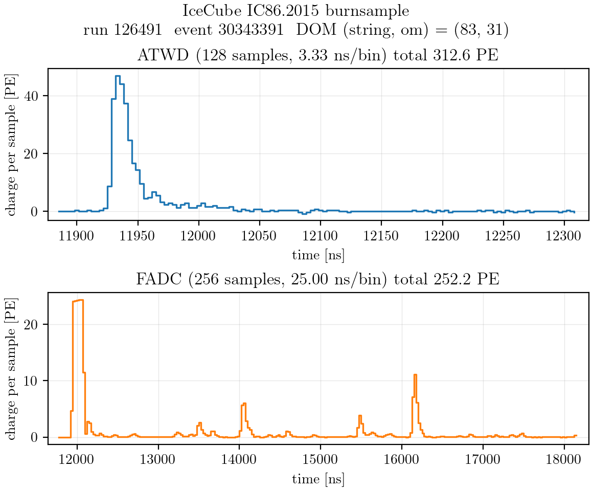

Original: [figures/report/plot_run126491_event30343391_DOM83-31-0.png](figures/report/plot_run126491_event30343391_DOM83-31-0.png)
Code/source: PNG copy of the waveform example from [waveform demo](analysis/MC_vs_BS_analysis/GBreweighting/validation/waveform_demo/).

#### `icecube_events.png`


Original: [figures/report/icecube_events.png](figures/report/icecube_events.png)
Code/source: external/reference event-type figure used in the report.

#### `event_display_through_stopped.pdf`


Original: [figures/report/event_display_through_stopped.pdf](figures/report/event_display_through_stopped.pdf)
Code/source: [plot_event_display_through_stopped.py](analysis/MC_vs_BS_analysis/GBreweighting/validation/plot_event_display_through_stopped.py), [pulse_event_display.py](analysis/MC_vs_BS_analysis/GBreweighting/validation/pulse_event_display.py).

#### `analysis_pipeline.pdf`

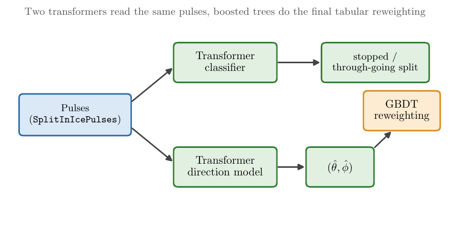

Original: [figures/report/analysis_pipeline.pdf](figures/report/analysis_pipeline.pdf)
Code/source: report pipeline schematic asset.

### Machine-Learning Schematics

#### `decision_tree.pdf`


Original: [figures/report/decision_tree.pdf](figures/report/decision_tree.pdf)
Code/source: [make_ch3_figures.py](figures/report/make_ch3_figures.py).

#### `bdt_schematic.pdf`


Original: [figures/report/bdt_schematic.pdf](figures/report/bdt_schematic.pdf)
Code/source: [make_ch3_figures.py](figures/report/make_ch3_figures.py).

#### `transformer_architecture.pdf`


Original: [figures/report/transformer_architecture.pdf](figures/report/transformer_architecture.pdf)
Code/source: [make_ch3_figures.py](figures/report/make_ch3_figures.py).

#### `transformer_attention.pdf`

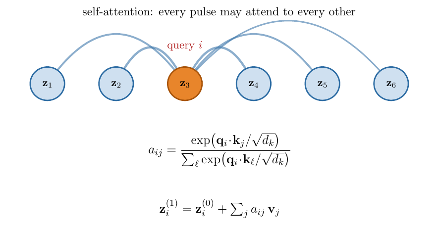

Original: [figures/report/transformer_attention.pdf](figures/report/transformer_attention.pdf)
Code/source: [make_transformer_simple.py](figures/report/make_transformer_simple.py).

#### `transformer_simple_horizontal.pdf`

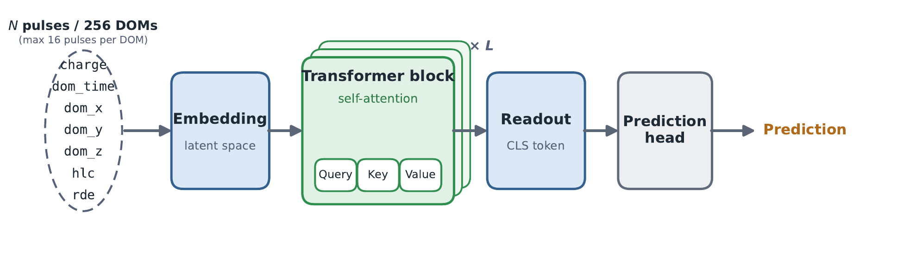

Original: [figures/report/transformer_simple_horizontal.pdf](figures/report/transformer_simple_horizontal.pdf)
Code/source: [make_transformer_simple.py](figures/report/make_transformer_simple.py).

#### `transformer_simple_horizontal.png`

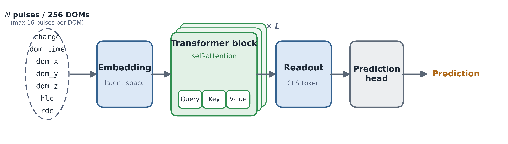

Original: [figures/report/transformer_simple_horizontal.png](figures/report/transformer_simple_horizontal.png)
Code/source: PNG copy from [make_transformer_simple.py](figures/report/make_transformer_simple.py).

#### `vmf_sphere.pdf`


Original: [figures/report/vmf_sphere.pdf](figures/report/vmf_sphere.pdf)
Code/source: vMF schematic asset used by the uncertainty section.

### Stopped vs Through-Going Classifier Figures

#### `training_history.pdf`


Original: [figures/report/training_history.pdf](figures/report/training_history.pdf)
Code/source: [train_stopped_transformer.py](analysis/ThroughOrStopped_muon/train_stopped_transformer.py), [plot_stopped_transformer_documentation.py](analysis/MC_vs_BS_analysis/GBreweighting/validation/stopped_transformer_documentation/plot_stopped_transformer_documentation.py).

#### `test_performance.pdf`


Original: [figures/report/test_performance.pdf](figures/report/test_performance.pdf)
Code/source: [plot_stopped_transformer_documentation.py](analysis/MC_vs_BS_analysis/GBreweighting/validation/stopped_transformer_documentation/plot_stopped_transformer_documentation.py).

#### `mc_test_score_distributions.pdf`


Original: [figures/report/mc_test_score_distributions.pdf](figures/report/mc_test_score_distributions.pdf)
Code/source: [plot_stopped_transformer_documentation.py](analysis/MC_vs_BS_analysis/GBreweighting/validation/stopped_transformer_documentation/plot_stopped_transformer_documentation.py).

### Baseline MC-vs-Data Distribution Figures

#### `pulse_level_variables_unmerged_full_page1.pdf`


Original: [figures/report/pulse_level_variables_unmerged_full_page1.pdf](figures/report/pulse_level_variables_unmerged_full_page1.pdf)
Code/source: [make_pulse_level_a4_figure.py](analysis/MC_vs_BS_analysis/GBreweighting/validation/make_pulse_level_a4_figure.py).

#### `pulse_level_variables_unmerged_full_page2.pdf`


Original: [figures/report/pulse_level_variables_unmerged_full_page2.pdf](figures/report/pulse_level_variables_unmerged_full_page2.pdf)
Code/source: [make_pulse_level_a4_figure.py](analysis/MC_vs_BS_analysis/GBreweighting/validation/make_pulse_level_a4_figure.py).

#### `pulse_level_variables_unmerged_full_page3.pdf`

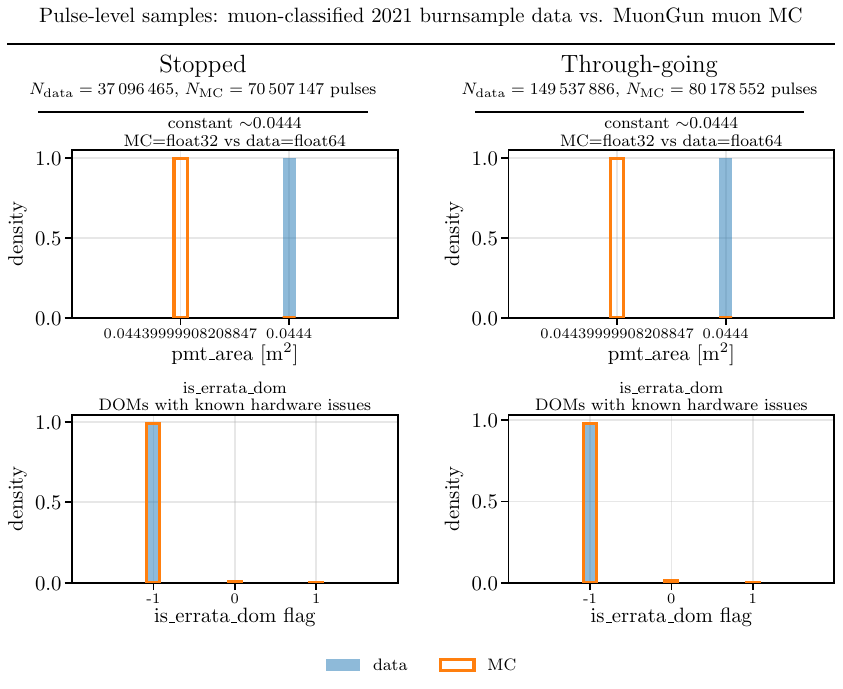

Original: [figures/report/pulse_level_variables_unmerged_full_page3.pdf](figures/report/pulse_level_variables_unmerged_full_page3.pdf)
Code/source: [make_pulse_level_a4_figure.py](analysis/MC_vs_BS_analysis/GBreweighting/validation/make_pulse_level_a4_figure.py).

#### `event_level_aggregates_unmerged_full_page1.pdf`


Original: [figures/report/event_level_aggregates_unmerged_full_page1.pdf](figures/report/event_level_aggregates_unmerged_full_page1.pdf)
Code/source: [make_event_aggregate_a4_figure.py](analysis/MC_vs_BS_analysis/GBreweighting/validation/make_event_aggregate_a4_figure.py).

#### `event_level_aggregates_unmerged_full_page2.pdf`


Original: [figures/report/event_level_aggregates_unmerged_full_page2.pdf](figures/report/event_level_aggregates_unmerged_full_page2.pdf)
Code/source: [make_event_aggregate_a4_figure.py](analysis/MC_vs_BS_analysis/GBreweighting/validation/make_event_aggregate_a4_figure.py).

#### `event_level_aggregates_unmerged_full_page3.pdf`


Original: [figures/report/event_level_aggregates_unmerged_full_page3.pdf](figures/report/event_level_aggregates_unmerged_full_page3.pdf)
Code/source: [make_event_aggregate_a4_figure.py](analysis/MC_vs_BS_analysis/GBreweighting/validation/make_event_aggregate_a4_figure.py).

### Direction Reconstruction And Angular GB Reweighting Figures

#### `training_history_direction.pdf`

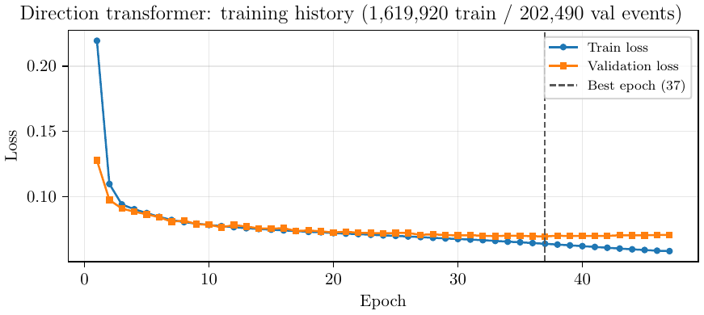

Original: [figures/report/training_history_direction.pdf](figures/report/training_history_direction.pdf)
Code/source: [direction transformer documentation](analysis/MC_vs_BS_analysis/GBreweighting/validation/direction_transformer_hlc_rde_unmerged_2M/documentation_plots/plot_direction_transformer_documentation.py).

#### `open_angle_performance.pdf`


Original: [figures/report/open_angle_performance.pdf](figures/report/open_angle_performance.pdf)
Code/source: [direction transformer documentation](analysis/MC_vs_BS_analysis/GBreweighting/validation/direction_transformer_hlc_rde_unmerged_2M/documentation_plots/plot_direction_transformer_documentation.py).

#### `mc_data_zenith_azimuth_overlay.pdf`


Original: [figures/report/mc_data_zenith_azimuth_overlay.pdf](figures/report/mc_data_zenith_azimuth_overlay.pdf)
Code/source: [direction transformer documentation](analysis/MC_vs_BS_analysis/GBreweighting/validation/direction_transformer_hlc_rde_unmerged_2M/documentation_plots/plot_direction_transformer_documentation.py).

#### `mc_data_zenith_azimuth_overlay_with_GBR.pdf`


Original: [figures/report/mc_data_zenith_azimuth_overlay_with_GBR.pdf](figures/report/mc_data_zenith_azimuth_overlay_with_GBR.pdf)
Code/source: [fit_GBreweighter_hlc_rde_unmerged_2M.py](analysis/MC_vs_BS_analysis/GBreweighting/fit_GBreweighter_hlc_rde_unmerged_2M.py), [direction transformer documentation](analysis/MC_vs_BS_analysis/GBreweighting/validation/direction_transformer_hlc_rde_unmerged_2M/documentation_plots/plot_direction_transformer_documentation.py).

#### `mc_data_zenith_azimuth_stopped.pdf`

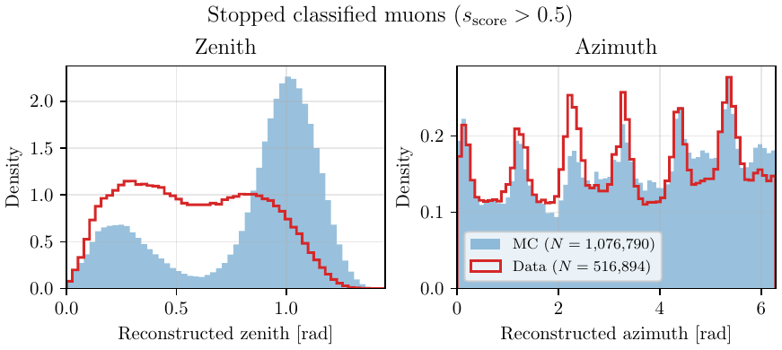

Original: [figures/report/mc_data_zenith_azimuth_stopped.pdf](figures/report/mc_data_zenith_azimuth_stopped.pdf)
Code/source: [direction transformer documentation plots](analysis/MC_vs_BS_analysis/GBreweighting/validation/direction_transformer_hlc_rde_unmerged_2M/documentation_plots/).

#### `mc_data_zenith_azimuth_through.pdf`

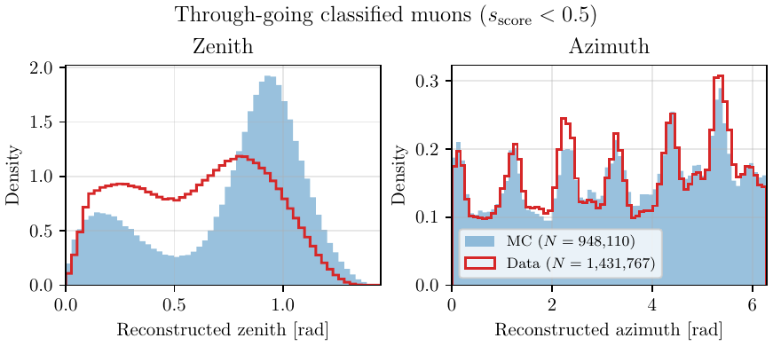

Original: [figures/report/mc_data_zenith_azimuth_through.pdf](figures/report/mc_data_zenith_azimuth_through.pdf)
Code/source: [direction transformer documentation plots](analysis/MC_vs_BS_analysis/GBreweighting/validation/direction_transformer_hlc_rde_unmerged_2M/documentation_plots/).

#### `pulse_level_variables_unmerged_gbweighted_full_page1.pdf`


Original: [figures/report/pulse_level_variables_unmerged_gbweighted_full_page1.pdf](figures/report/pulse_level_variables_unmerged_gbweighted_full_page1.pdf)
Code/source: [make_pulse_level_a4_figure.py](analysis/MC_vs_BS_analysis/GBreweighting/validation/make_pulse_level_a4_figure.py).

#### `pulse_level_variables_unmerged_gbweighted_full_page2.pdf`


Original: [figures/report/pulse_level_variables_unmerged_gbweighted_full_page2.pdf](figures/report/pulse_level_variables_unmerged_gbweighted_full_page2.pdf)
Code/source: [make_pulse_level_a4_figure.py](analysis/MC_vs_BS_analysis/GBreweighting/validation/make_pulse_level_a4_figure.py).

#### `event_level_aggregates_unmerged_gbweighted_full_page1.pdf`


Original: [figures/report/event_level_aggregates_unmerged_gbweighted_full_page1.pdf](figures/report/event_level_aggregates_unmerged_gbweighted_full_page1.pdf)
Code/source: [make_event_aggregate_a4_figure.py](analysis/MC_vs_BS_analysis/GBreweighting/validation/make_event_aggregate_a4_figure.py).

#### `event_level_aggregates_unmerged_gbweighted_full_page2.pdf`


Original: [figures/report/event_level_aggregates_unmerged_gbweighted_full_page2.pdf](figures/report/event_level_aggregates_unmerged_gbweighted_full_page2.pdf)
Code/source: [make_event_aggregate_a4_figure.py](analysis/MC_vs_BS_analysis/GBreweighting/validation/make_event_aggregate_a4_figure.py).

#### `event_level_aggregates_unmerged_gbweighted_full_page3.pdf`


Original: [figures/report/event_level_aggregates_unmerged_gbweighted_full_page3.pdf](figures/report/event_level_aggregates_unmerged_gbweighted_full_page3.pdf)
Code/source: [make_event_aggregate_a4_figure.py](analysis/MC_vs_BS_analysis/GBreweighting/validation/make_event_aggregate_a4_figure.py).

### Pulse Merging And HLC Figures

#### `small_pulses_through_run136141_event242722_string61_dom3_final_legend_default_up.pdf`


Original: [figures/report/small_pulses_through_run136141_event242722_string61_dom3_final_legend_default_up.pdf](figures/report/small_pulses_through_run136141_event242722_string61_dom3_final_legend_default_up.pdf)
Code/source: [make_small_pulse_merge_plot.py](analysis/MC_vs_BS_analysis/GBreweighting/validation/Data_vs_MC_new/plots/small_pulses/make_small_pulse_merge_plot.py), [pulse_merger.py](analysis/MC_vs_BS_analysis/GBreweighting/pulse_merger.py).

#### `mc_data_charge_hlc_slc.pdf`


Original: [figures/report/mc_data_charge_hlc_slc.pdf](figures/report/mc_data_charge_hlc_slc.pdf)
Code/source: [plot_pulse_merging.py](analysis/MC_vs_BS_analysis/GBreweighting/validation/data_parquet_v2/pulse_merging_plots/plot_pulse_merging.py).

#### `pulses_per_dom.pdf`


Original: [figures/report/pulses_per_dom.pdf](figures/report/pulses_per_dom.pdf)
Code/source: [plot_pulse_merging.py](analysis/MC_vs_BS_analysis/GBreweighting/validation/data_parquet_v2/pulse_merging_plots/plot_pulse_merging.py).

#### `hlc_flip_rate_sweep_merged_v2_stopped_through_side_by_side_0_to_10p0_step0p5.pdf`


Original: [figures/report/hlc_flip_rate_sweep_merged_v2_stopped_through_side_by_side_0_to_10p0_step0p5.pdf](figures/report/hlc_flip_rate_sweep_merged_v2_stopped_through_side_by_side_0_to_10p0_step0p5.pdf)
Code/source: [run_hlc_flip_sweep_merged_v2_all.py](analysis/MC_vs_BS_analysis/GBreweighting/validation/run_hlc_flip_sweep_merged_v2_all.py), [plot_hlc_flip_sweep_merged_v2_side_by_side.py](analysis/MC_vs_BS_analysis/GBreweighting/validation/plot_hlc_flip_sweep_merged_v2_side_by_side.py).

#### `hlc_frac_mc_vs_data_merged_v2_stopped_through_best_transformer_flip_side_by_side.pdf`


Original: [figures/report/hlc_frac_mc_vs_data_merged_v2_stopped_through_best_transformer_flip_side_by_side.pdf](figures/report/hlc_frac_mc_vs_data_merged_v2_stopped_through_best_transformer_flip_side_by_side.pdf)
Code/source: [plot_hlc_frac_merged_v2_best_transformer_flip.py](analysis/MC_vs_BS_analysis/GBreweighting/validation/plot_hlc_frac_merged_v2_best_transformer_flip.py).

### Charge-Time And Afterpulse Figures

#### `afterpulse_stopped_mc_transformer_hlcflip_best.pdf`


Original: [figures/report/afterpulse_stopped_mc_transformer_hlcflip_best.pdf](figures/report/afterpulse_stopped_mc_transformer_hlcflip_best.pdf)
Code/source: [plot_afterpulse_a4_transformer_hlcflip_best.py](analysis/MC_vs_BS_analysis/GBreweighting/validation/plot_afterpulse_a4_transformer_hlcflip_best.py).

#### `afterpulse_stopped_data_transformer_hlcflip_best.pdf`


Original: [figures/report/afterpulse_stopped_data_transformer_hlcflip_best.pdf](figures/report/afterpulse_stopped_data_transformer_hlcflip_best.pdf)
Code/source: [plot_afterpulse_a4_transformer_hlcflip_best.py](analysis/MC_vs_BS_analysis/GBreweighting/validation/plot_afterpulse_a4_transformer_hlcflip_best.py).

#### `afterpulse_stopped_mc_over_data_transformer_hlcflip_best.pdf`


Original: [figures/report/afterpulse_stopped_mc_over_data_transformer_hlcflip_best.pdf](figures/report/afterpulse_stopped_mc_over_data_transformer_hlcflip_best.pdf)
Code/source: [plot_afterpulse_a4_transformer_hlcflip_best.py](analysis/MC_vs_BS_analysis/GBreweighting/validation/plot_afterpulse_a4_transformer_hlcflip_best.py).

#### `afterpulse_through_mc_transformer_hlcflip_best.pdf`


Original: [figures/report/afterpulse_through_mc_transformer_hlcflip_best.pdf](figures/report/afterpulse_through_mc_transformer_hlcflip_best.pdf)
Code/source: [plot_afterpulse_a4_transformer_hlcflip_best.py](analysis/MC_vs_BS_analysis/GBreweighting/validation/plot_afterpulse_a4_transformer_hlcflip_best.py).

#### `afterpulse_through_data_transformer_hlcflip_best.pdf`


Original: [figures/report/afterpulse_through_data_transformer_hlcflip_best.pdf](figures/report/afterpulse_through_data_transformer_hlcflip_best.pdf)
Code/source: [plot_afterpulse_a4_transformer_hlcflip_best.py](analysis/MC_vs_BS_analysis/GBreweighting/validation/plot_afterpulse_a4_transformer_hlcflip_best.py).

#### `afterpulse_through_mc_over_data_transformer_hlcflip_best.pdf`


Original: [figures/report/afterpulse_through_mc_over_data_transformer_hlcflip_best.pdf](figures/report/afterpulse_through_mc_over_data_transformer_hlcflip_best.pdf)
Code/source: [plot_afterpulse_a4_transformer_hlcflip_best.py](analysis/MC_vs_BS_analysis/GBreweighting/validation/plot_afterpulse_a4_transformer_hlcflip_best.py).

### vMF Uncertainty And Final Benchmark Figures

#### `vmf_training_history_loss_opening_kappa.pdf`


Original: [figures/report/vmf_training_history_loss_opening_kappa.pdf](figures/report/vmf_training_history_loss_opening_kappa.pdf)
Code/source: [train_vmf_final_hlcflip.py](analysis/MC_vs_BS_analysis/GBreweighting/validation/direction_transformer_vmf_final_hlcflip/train_vmf_final_hlcflip.py), [plot_vmf_uncertainty_final_hlcflip.py](analysis/MC_vs_BS_analysis/GBreweighting/validation/plot_vmf_uncertainty_final_hlcflip.py).

#### `vmf_kappa_mc_data_stopped_through_side_by_side.pdf`


Original: [figures/report/vmf_kappa_mc_data_stopped_through_side_by_side.pdf](figures/report/vmf_kappa_mc_data_stopped_through_side_by_side.pdf)
Code/source: [plot_vmf_uncertainty_final_hlcflip.py](analysis/MC_vs_BS_analysis/GBreweighting/validation/plot_vmf_uncertainty_final_hlcflip.py).

#### `vmf_pole_collapse_evidence.pdf`


Original: [figures/report/vmf_pole_collapse_evidence.pdf](figures/report/vmf_pole_collapse_evidence.pdf)
Code/source: [plot_vmf_pole_collapse_evidence.py](analysis/MC_vs_BS_analysis/GBreweighting/validation/plot_vmf_pole_collapse_evidence.py), [diagnose_low_kappa_mc.py](analysis/MC_vs_BS_analysis/GBreweighting/validation/diagnose_low_kappa_mc.py).

#### `five_stage_logit_roc_overlay_combined.pdf`


Original: [figures/report/five_stage_logit_roc_overlay_combined.pdf](figures/report/five_stage_logit_roc_overlay_combined.pdf)
Code/source: [plot_stage_logit_roc_overlay.py](analysis/MC_vs_BS_analysis/GBreweighting/validation/Data_vs_MC_new/plot_stage_logit_roc_overlay.py).

#### `logit_catalog_common_xlim.pdf`


Original: [figures/report/logit_catalog_common_xlim.pdf](figures/report/logit_catalog_common_xlim.pdf)
Code/source: [plot_stage_logit_catalog.py](analysis/MC_vs_BS_analysis/GBreweighting/validation/Data_vs_MC_new/plot_stage_logit_catalog.py).

### Extra Report Image Assets

These visual files were also present in `final/figures` and are kept so the
GitHub figure archive matches the report figure workspace.

#### `forside_bg.png`

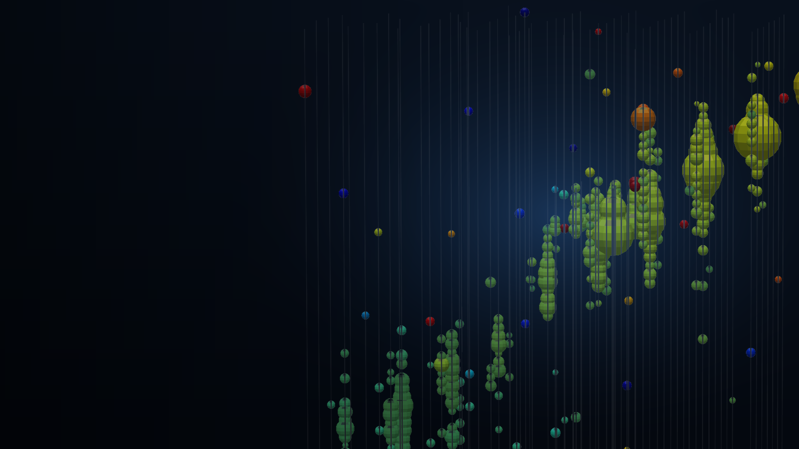

Original: [figures/report/forside_bg.png](figures/report/forside_bg.png)
Code/source: front-page/report asset.

#### `image1.png`

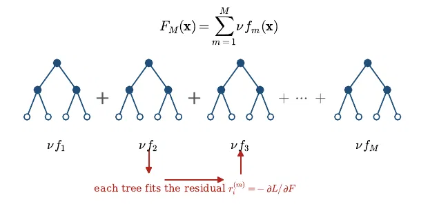

Original: [figures/report/image1.png](figures/report/image1.png)
Code/source: report image asset copied from `final/figures`.

#### `image2.png`

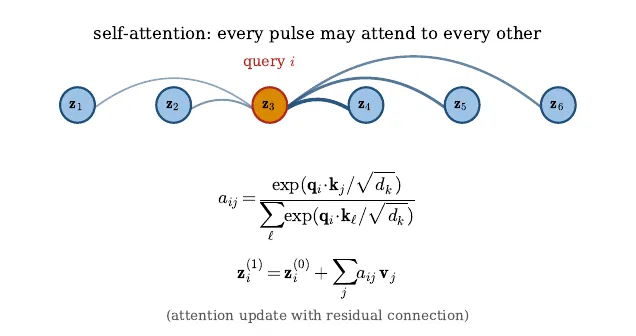

Original: [figures/report/image2.png](figures/report/image2.png)
Code/source: report image asset copied from `final/figures`.

#### `image3.png`

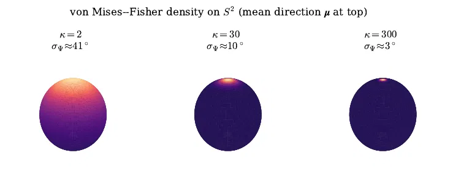

Original: [figures/report/image3.png](figures/report/image3.png)
Code/source: report image asset copied from `final/figures`.

#### `image4.png`

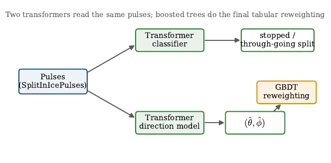

Original: [figures/report/image4.png](figures/report/image4.png)
Code/source: report image asset copied from `final/figures`.

#### `view_tr-1.png`

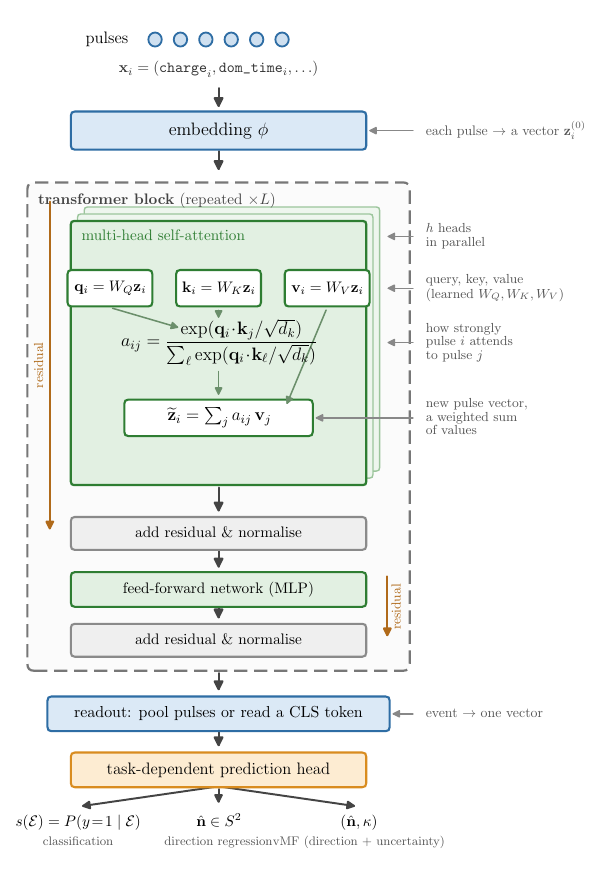

Original: [figures/report/view_tr-1.png](figures/report/view_tr-1.png)
Code/source: report image asset copied from `final/figures`.

## What Is Not Here

The repository intentionally excludes raw data and heavy products:

- IceCube `.i3`, SQLite `.db`, parquet, CSV, NumPy, pickle, HDF5, and ROOT data.
- Model checkpoints and exported weights.
- Slurm logs, cache directories, and local notebook checkpoints.
- The local LaTeX report build products from `/groups/icecube/holgerkc/final`.

The included figures are exceptions because they are part of the readable
GitHub version of the project and are needed to inspect the results without
regenerating the full analysis.

## AI Assistance Note

This GitHub-facing project archive and documentation structure was assembled
with help from OpenAI Codex. The scientific work, analysis ideas, and local
project files come from Holger Klevang Christiansen's IceCube preparation
project; Codex was used to organize the repository, connect figures to code,
and write the navigational documentation.
