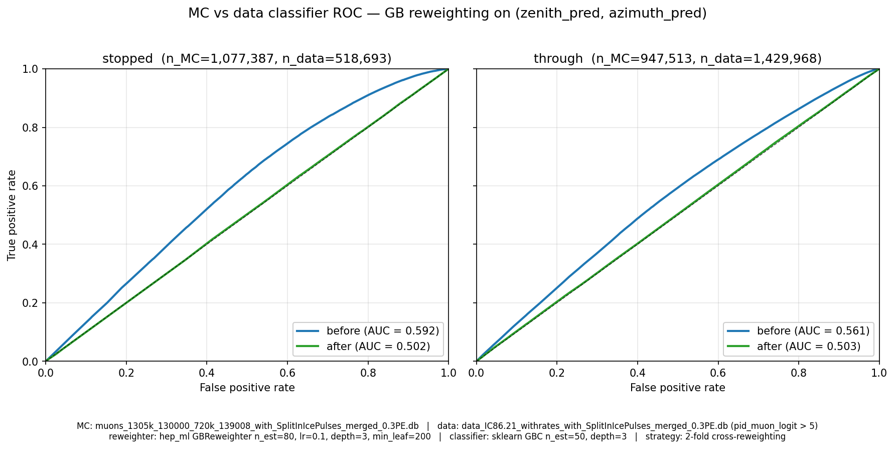
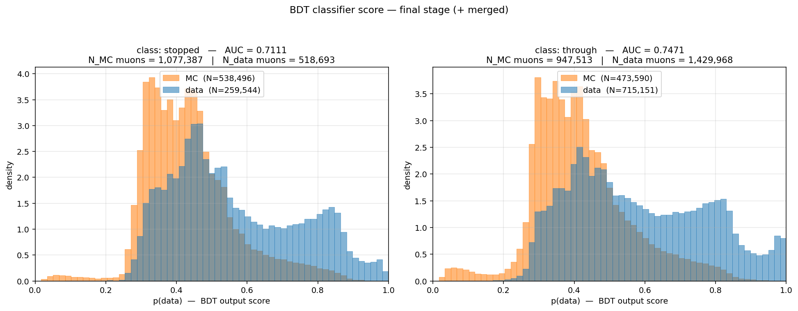
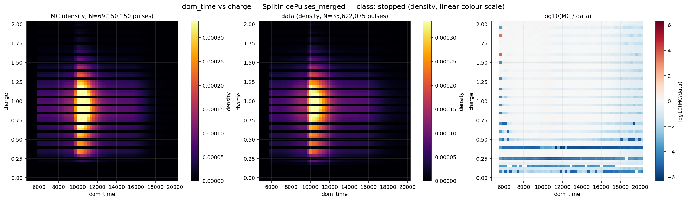
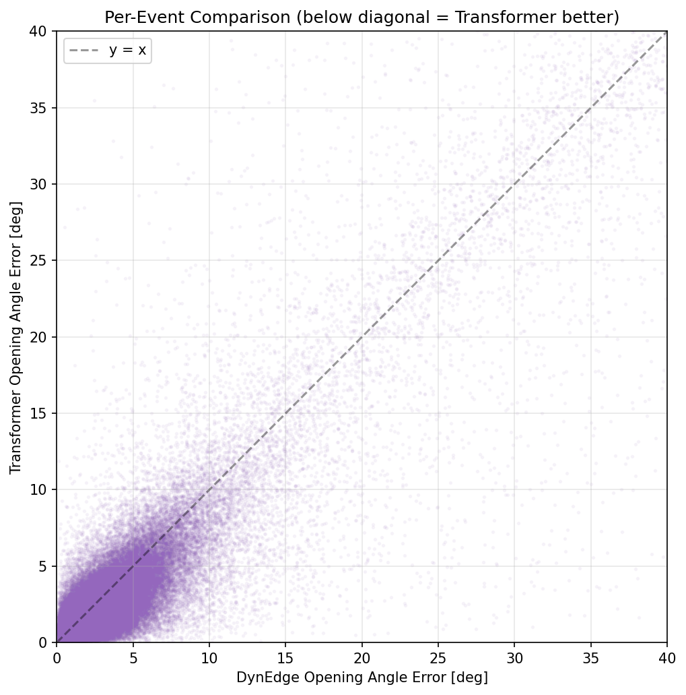
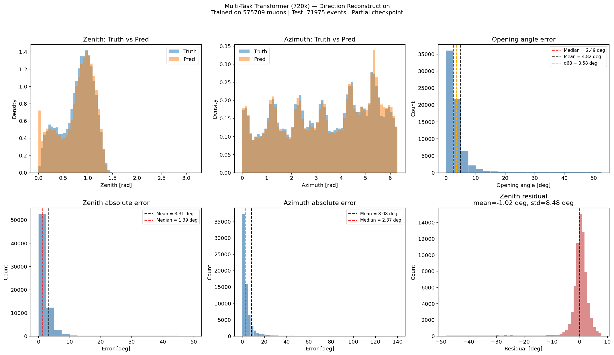
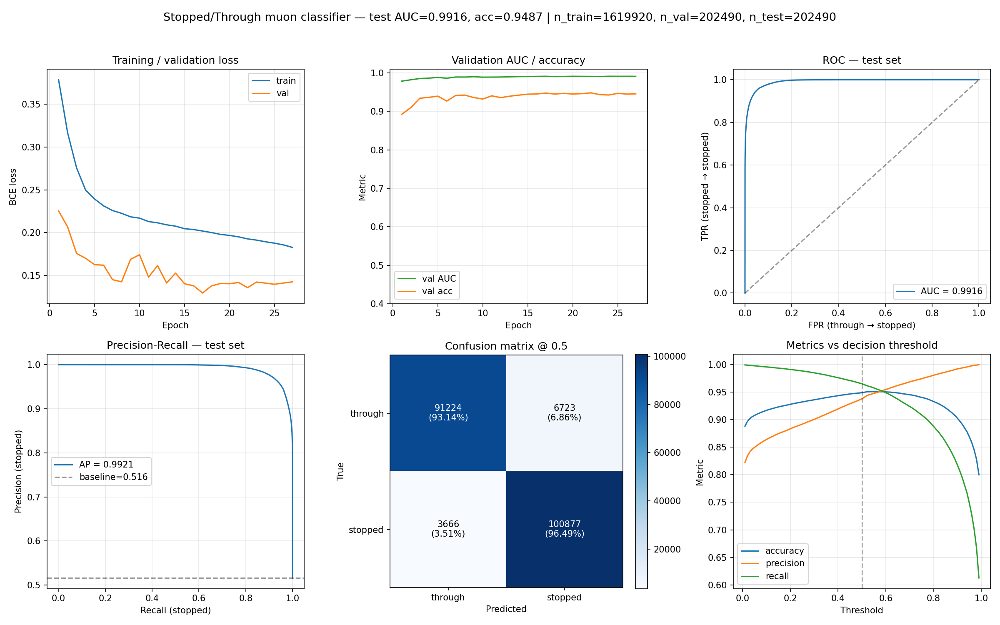

# IceCube Thesis Analysis

Machine-learning framework for reconstructing and classifying events in the
[IceCube Neutrino Observatory](https://icecube.wisc.edu/). This repository
contains the analysis code developed for my Master's thesis at the
Niels Bohr Institute, University of Copenhagen.

The work applies graph neural networks and pulse-level transformers to raw
detector data to estimate particle properties (direction, energy, position,
particle type, track topology) and to validate Monte Carlo simulations
against real burnsample data using gradient-boosted reweighting.

---

## Latest work — MC vs. data validation with GBReweighter

The most recent module is
[`MC_vs_BS_analysis/GBreweighting/`](MC_vs_BS_analysis/GBreweighting/) — a
full pipeline for correcting Monte Carlo to match real IceCube data and a
[validation suite](MC_vs_BS_analysis/GBreweighting/validation/) that
quantifies how well the correction worked.

**Pipeline.** Pulses are first merged below 0.3 PE (à la Simon Debes,
[`pulse_merger.py`](MC_vs_BS_analysis/GBreweighting/pulse_merger.py)),
then a [`GBReweighter`](MC_vs_BS_analysis/GBreweighting/fit_GBreweighter.py)
is fit on `(zenith_pred, azimuth_pred)` with 2-fold cross-reweighting,
separately for stopped and through-going muons. Each MC event ends up with
a `final_weight = base_weight × gb_weight` written to
`GB_and_base_weights_{stopped,through}.csv`.

**Validation suite** (in [`validation/`](MC_vs_BS_analysis/GBreweighting/validation/)).
Three independent checks of MC↔data agreement after reweighting, all driven
from the same parquet pulse tables exported from the SQLite databases:

| Check | Script | Output |
|---|---|---|
| 1D weighted histograms across all per-pulse and per-event observables | [`compare_weighted_mc_vs_data_parquet.py`](MC_vs_BS_analysis/GBreweighting/validation/compare_weighted_mc_vs_data_parquet.py) | [`mc_vs_data_combined_parquet.png`](MC_vs_BS_analysis/GBreweighting/validation/plots/mc_vs_data_combined_parquet.png) |
| 2D pulse heatmaps (`dom_time` × `charge`) with `log10(MC/data)` panel | [`plot_pulse_2d_mc_vs_data.py`](MC_vs_BS_analysis/GBreweighting/validation/plot_pulse_2d_mc_vs_data.py) | [`2d_dom_time_vs_charge_*_merged_density.png`](MC_vs_BS_analysis/GBreweighting/validation/plots/) |
| BDT classifier MC-vs-data ROC across 3 processing stages | [`compare_bdt_mc_vs_data_stages.py`](MC_vs_BS_analysis/GBreweighting/validation/compare_bdt_mc_vs_data_stages.py) | [`bdt_stages_roc_{stopped,through}.png`](MC_vs_BS_analysis/GBreweighting/validation/plots/) |

The BDT is the headline metric: a `HistGradientBoostingClassifier` is
trained to separate MC from data on 12 per-event aggregates. AUC → 0.5
means the simulation is indistinguishable from data. Permutation
importances on the final stage flag exactly which features still differ
the most — see the breakdown in
[`validation/README.md`](MC_vs_BS_analysis/GBreweighting/validation/README.md).

The pulse files used by every plot are documented (schema, weights,
loading patterns, GraphNeT-style streaming) in
[`validation/data_parquet/README.md`](MC_vs_BS_analysis/GBreweighting/validation/data_parquet/README.md).

---

## Highlights

| | |
|---|---|
| **GBReweighter MC→data, before vs. after** — ROC of an MC-vs-data classifier on reconstructed direction. AUC drops toward 0.5 once the GB weights are applied. |  |
| **MC-vs-data BDT — score distributions, final stage** (merged pulses + float-fix). Closer to fully overlapping = better simulation. |  |
| **MC vs. data — per-pulse 2D density**, stopped class. Three panels: MC, data, `log10(MC/data)` — shows *where* in observable space they still disagree. |  |
| **Transformer muon reconstruction (720k events)** — per-event predicted vs. true zenith/azimuth/energy/vertex-z with the pulse transformer. |  |
| **Multi-task transformer — direction evaluation.** Shared backbone, joint heads for energy, direction and vertex position. |  |
| **Stopped vs. through-going muon classifier.** Pulse transformer + event-level summary features. |  |

> **Note on data and weights.** IceCube simulation databases, burnsample
> data, and trained model checkpoints are not distributed with this
> repository — they live on the HEP cluster at NBI and are too large for
> version control. The code is provided as-is for reference; paths in
> configs point to `/groups/icecube/...` and must be adapted to run
> outside the NBI environment.

---

## Physics context

IceCube is a cubic-kilometre neutrino detector instrumented with ~5000
digital optical modules (DOMs) deep in the Antarctic ice. Neutrinos are
observed indirectly through the Cherenkov light produced by charged
secondary particles (mainly muons and cascades) traversing the ice.

Each event is a sparse point cloud of DOM pulses with features
*(x, y, z, t, charge)*. The analysis task is to map that point cloud to
physical quantities:

- **Particle type (PID).** Is the event a track (νμ CC), a cascade
  (νe / ντ / NC), or an atmospheric muon background?
- **Direction.** Zenith and azimuth of the incoming particle.
- **Energy.** Deposited energy, correlated with the neutrino energy.
- **Interaction vertex.** Where in the detector did the event start?
- **Track topology.** For muons: does the track stop inside the
  detector or pass straight through?
- **Simulation realism.** Quantify how well Monte Carlo reproduces the
  real detector data and correct it where it doesn't.

Classical reconstructions rely on hand-crafted likelihoods. The models
here instead learn directly from pulse-level data using GNNs (via
[GraphNeT](https://github.com/graphnet-team/graphnet)) and custom pulse
transformers built in PyTorch / PyTorch Lightning.

---

## Repository layout

```
.
├── I3_reader/                       # Read raw IceCube .i3 simulation files
├── Classifiers/                     # All ML models (GNN + transformers)
│   ├── PID_Classifier/              #   Particle-ID multiclass GNN
│   ├── Energy_recon/                #   Energy regression GNN
│   ├── finding_the_angles/          #   Direction reconstruction (DynEdge)
│   ├── Inars_zenith_azimuth_        #   Pulse transformer for direction,
│   │   transformer_recon/           #   energy and vertex position
│   └── Muon_Reconstruction/         #   Model zoo for muon reconstruction
│       ├── dynedge_40k_l3_muons/    #     DynEdge GNN baseline (40k sample)
│       ├── dynedge_720k/            #     DynEdge GNN on 720k muons
│       ├── dynedge_transformer/     #     DynEdge + transformer hybrid
│       ├── pulse_transformer/       #     Pulse-level transformer
│       ├── dom_transformer/         #     DOM-aggregated transformer
│       ├── multi_task_transformer/  #     Multi-task (E, dir, pos) head
│       └── reweighting_multitask_   #     GBReweighter MC→BS on reco
│           mc_to_bs/                #     features
├── MC_vs_BS_analysis/               # Monte Carlo vs. burnsample comparison
│   ├── GBreweighting/               #   ★ NEW: pulse-level GB reweighting
│   │   ├── pulse_merger.py          #     0.3 PE pulse merging
│   │   ├── fit_GBreweighter.py      #     2-fold cross-reweighting
│   │   ├── doc/                     #     LaTeX writeup of the method
│   │   └── validation/              #     ★ MC↔data validation suite
│   │       ├── compare_weighted_*   #       1D histograms (log + linear)
│   │       ├── plot_pulse_2d_*      #       2D heatmaps with log(MC/data)
│   │       ├── compare_bdt_*        #       BDT MC-vs-data classifier
│   │       └── data_parquet/        #       Parquet pulse/truth tables
│   ├── zenith_azimuth_inference/    #   Transformer inference on MC + data
│   ├── scripts/                     #   DB construction, inference drivers
│   └── notebooks/                   #   Exploratory plots and checks
└── ThroughOrStopped_muon/           # Pulse-transformer stopped/through classifier
    └── inference/                   #   Inference on full MC + data sets
```

---

## Components in more detail

### `MC_vs_BS_analysis/GBreweighting/` — MC-to-data reweighting (★ newest)
End-to-end pipeline for bringing IC86.21 simulation into agreement with
the burnsample. The reweighting is fit in reconstructed direction space
with a `hep_ml.GBReweighter` (2-fold cross, per stopped/through class).
The accompanying [`validation/`](MC_vs_BS_analysis/GBreweighting/validation/)
folder is a self-contained MC↔data benchmark — 1D histograms, 2D
heatmaps, and a `HistGradientBoostingClassifier` that quantifies how
distinguishable MC and data still are at three processing stages (raw,
+ float-fix, + pulse merging). The pulse data feeding all plots lives
as parquet in [`validation/data_parquet/`](MC_vs_BS_analysis/GBreweighting/validation/data_parquet/),
documented in detail.

### `Classifiers/Inars_zenith_azimuth_transformer_recon/`
Custom pulse transformer (each pulse = one token) trained to
simultaneously reconstruct direction, energy and vertex-Z. Benchmarked
against the DynEdge baseline in `notebooks/`. Adds an MC-vs-data
training branch (`scripts/train_mc_vs_data.py` + `submit_mc_vs_data_chain.sh`)
that uses the architecture as a discriminator.

### `Classifiers/Muon_Reconstruction/`
Model zoo on a common 720k-event muon dataset:

- **DynEdge** (GraphNeT baseline) at 40k and 720k events.
- **Pulse transformer** — each DOM hit is a transformer token.
- **DOM transformer** — tokens aggregated per DOM.
- **DynEdge + transformer hybrid** — GNN feature extractor feeding a
  transformer head.
- **Multi-task transformer** — shared backbone, per-task heads for
  energy, direction and vertex.
- **`reweighting_multitask_mc_to_bs/`** — earlier 3-step reweighting
  pipeline on reconstructed features (precursor to the
  `GBreweighting/` pipeline above).

### `ThroughOrStopped_muon/`
Binary pulse-level transformer that predicts `P(stopped | pulses)`. A
stopped muon deposits all its remaining energy inside the detector
volume; a through-going muon exits the other side. Model combines a
shared pulse transformer backbone with event-level summary features
(`Q_tot`, `N_hits`, `Δt`, `Δz`, charge-weighted `z`, `t_std`) in a
single binary head. The stopped score also feeds the GB reweighting
class split. Training and inference run on SLURM via the
`slurm_*.sh` scripts.

### `Classifiers/PID_Classifier/`
Multiclass GraphNeT/DynEdge model that assigns each event a PID
probability (νμ CC, νe / ντ, NC, muon background).
`unified_run.py` is a general-purpose driver supporting PID, energy,
direction and vertex tasks from a single YAML config.

### `Classifiers/Energy_recon/` and `Classifiers/finding_the_angles/`
GNN regressor for event energy (built on GraphNeT with the
IceCubeDeepCore detector module), and a collection of DynEdge direction
reconstructions trained on MuonGun muons and low-energy neutrinos.

### `I3_reader/`
Starting point of the pipeline. A notebook that opens IceCube `.i3`
simulation files with `icetray` and extracts pulses and truth-level
labels into SQLite/pandas-friendly form for downstream training.

---

## Tech stack

- **Python 3.9 / 3.11**, **PyTorch**, **PyTorch Lightning**
- [**GraphNeT**](https://github.com/graphnet-team/graphnet) — graph
  neural networks for neutrino telescopes (DynEdge architecture)
- **`icetray`** / **`dataio`** — official IceCube framework for reading
  `.i3` files
- **`hep_ml`** — gradient-boosted reweighting (`GBReweighter`) for the
  MC-to-data correction step
- **`scikit-learn`** — `HistGradientBoostingClassifier` for the MC-vs-data
  validation BDT
- **SQLite** + **Apache Parquet** (zstd, dictionary-encoded, sorted by
  `event_no`) — event databases produced from the I3 files
- **Weights & Biases** — experiment tracking for the transformer runs
- **SLURM** — training and inference jobs run on the NBI HEP cluster;
  `slurm_*.sh` scripts are included for reference

---

## Running the code

Most entry points assume a GraphNeT-compatible environment with CUDA
and the IceCube software stack available. Broadly:

1. **Build a database.** Use `I3_reader/` or the scripts in
   `MC_vs_BS_analysis/scripts/` to convert `.i3` files into a SQLite
   database of events and pulses.
2. **Train a model.** Each subfolder of `Classifiers/` has a `train_*.py`
   script and a YAML/JSON config with data paths, model hyperparameters
   and loss configuration.
3. **Run inference.** Use `inference/run_inference.py` (or the
   per-module equivalent) against the trained checkpoint; predictions
   are written as CSV.
4. **Reweight + validate.** Run `MC_vs_BS_analysis/GBreweighting/pulse_merger.py`
   then `fit_GBreweighter.py`, then export to parquet
   (`validation/export_to_parquet.py`) and run the comparison scripts.
5. **Analyze.** The `notebooks/` and `results/` folders contain the
   evaluation plots, per-event scatter plots and metric summaries used
   in the thesis.

Paths in configs currently point to the NBI cluster filesystem; they
need to be adapted for any other environment.

---

## Author

Holger Christiansen — Master's student, Niels Bohr Institute,
University of Copenhagen. Thesis analysis on IceCube data using deep
learning for event reconstruction and Monte Carlo validation.
