# Narrowing the Gap Between Simulation and Real Data in IceCube

Master Thesis Preparation Project, Niels Bohr Institute.

This repository is the GitHub version of the project written locally in
`/groups/icecube/holgerkc/final/main.tex` and implemented through analysis code
from `/groups/icecube/holgerkc/Thesis_Analysis`. It is not a dump of the LaTeX
workspace. It is a self-contained project archive: the scientific story, the
figures, and the code needed to locate how each result was produced.

The project asks a deliberately practical question:

> If an IceCube machine-learning model is trained on simulation and applied to
> real data, how visible is the remaining simulation-to-data mismatch?

The answer is that the mismatch is very visible. A pulse-level transformer can
separate real 2021 burnsample atmospheric muons from simulated Muon Gun
atmospheric muons almost perfectly. The project then applies a sequence of
targeted corrections. They reduce the mismatch, especially for stopped muons,
but the final samples are still clearly distinguishable.

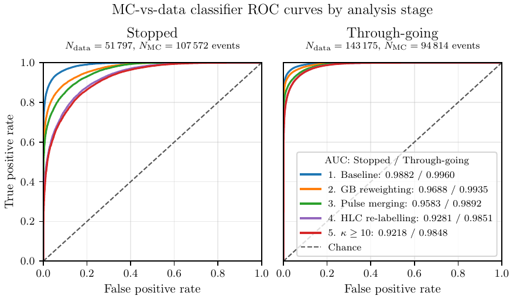

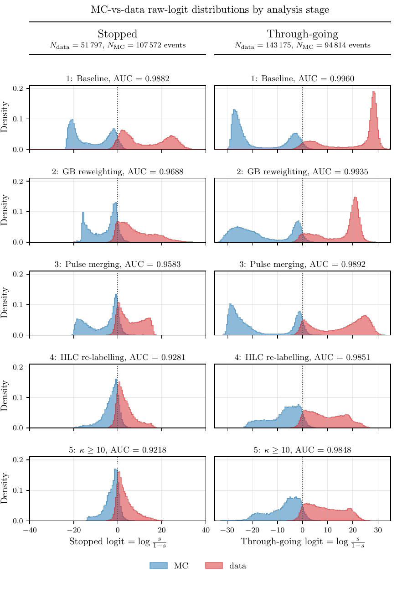

Read together, these two figures are the shortest version of the project. The
ROC curves show that MC and data remain rank-separable after all corrections.
The logit distributions show that the corrections still matter: the classifier
loses much of its confidence, especially for stopped muons.

## Main Result

The main diagnostic is a binary MC-vs-data classifier. An AUC of `0.5` would
mean that data and simulation are indistinguishable to the benchmark model. The
table shows the project in one line: each correction helps, but none closes the
gap.

| Stage | What changed | Stopped AUC | Through-going AUC |
|---|---|---:|---:|
| Baseline | No correction | 0.9882 | 0.9960 |
| Angular GB reweighting | MC direction distribution reweighted to data | 0.9688 | 0.9935 |
| Pulse merging | Low-charge satellite pulses merged on each DOM | 0.9583 | 0.9892 |
| HLC re-labelling | Most HLC-like simulated SLC pulses flipped to HLC | 0.9281 | 0.9851 |
| Low-`kappa` removal | Low-confidence vMF direction events removed | 0.9218 | 0.9848 |

The largest single improvement comes from the data-driven HLC re-labelling.
The final ROC is still far from chance, but the corresponding logit
distributions show that the classifier becomes much less confident after the
corrections. In other words: the gap is narrowed, not solved.

## How To Read This Repository

- Start with this README for the story and the central figures.
- Open [docs/project_summary.md](docs/project_summary.md) for a shorter
  report-style walkthrough.
- Open [docs/figure_index.md](docs/figure_index.md) when you want figure to
  code provenance in table form.
- Open [docs/report_traceability.md](docs/report_traceability.md) to audit
  which report sections, figures, tables, and numerical results are backed by
  which code or source.
- Open [docs/code_map.md](docs/code_map.md) to navigate the analysis tree by
  scientific task.
- Open [docs/reproduction_notes.md](docs/reproduction_notes.md) for what is
  included, what is deliberately excluded, and what would be needed to rerun
  the analysis.
- Browse [analysis/](analysis/) for the copied analysis source. Raw data,
  generated parquet files, SQLite databases, checkpoints, and logs are not
  included.

## Scientific Story

IceCube analyses often train models on Monte Carlo simulation because only
simulation provides truth labels. That workflow is only reliable if simulation
and real detector data are sufficiently aligned in the variables seen by the
model. This project stress-tests that assumption with atmospheric muons:
abundant, track-like events that exercise the same detector, ice, readout, and
reconstruction chain as signal-like muons.

The analysis proceeds as follows:

1. Define the detector data representation: `SplitInIcePulses`, where each
   event is a variable-size set of pulse tokens with charge, time, DOM
   position, HLC/SLC flag, and relative DOM efficiency.
2. Separate atmospheric muons into stopped and through-going classes using a
   transformer trained on MC truth, then apply the same classifier to MC and
   data.
3. Train a pulse-level transformer to distinguish MC from data. This becomes
   the benchmark for simulation-to-data mismatch.
4. Apply four corrections or diagnostics in sequence: angular GB reweighting,
   pulse merging, HLC re-labelling, and a vMF uncertainty cut.
5. Compare the full correction chain with ROC curves and logit distributions.

## Key Takeaways

| Finding | Evidence | Where to look |
|---|---|---|
| MC and data are strongly separable before correction. | Baseline MC-vs-data AUC is `0.9882` for stopped and `0.9960` for through-going events. | [Baseline comparison](#5-baseline-mc-vs-data-comparison) |
| Direction matters, but is not the whole problem. | GB reweighting in reconstructed zenith/azimuth improves the benchmark but leaves high AUCs. | [Angular reweighting](#6-direction-reconstruction-and-angular-gb-reweighting) |
| Low-charge DOM behavior is an important handle. | Pulse merging reduces small-pulse mismatches and modestly lowers MC-vs-data separability. | [Pulse merging](#7-pulse-merging) |
| HLC/SLC modelling carries major residual information. | HLC re-labelling gives the largest single AUC improvement. | [HLC re-labelling](#8-feature-importance-and-hlc-re-labelling) |
| Learned direction uncertainty exposes a problematic MC population. | Low-`kappa` MC events show a pole-collapse signature; removing them gives the final benchmark row. | [vMF uncertainty](#10-vmf-uncertainty-and-final-diagnostic) |

## Repository Layout

```text
.
├── analysis/
│   ├── ThroughOrStopped_muon/
│   ├── MC_vs_BS_analysis/
│   │   ├── scripts/
│   │   ├── zenith_azimuth_inference/
│   │   └── GBreweighting/
│   └── Classifiers/
├── docs/
│   ├── project_summary.md
│   ├── figure_index.md
│   ├── code_map.md
│   └── reproduction_notes.md
└── figures/
    ├── report/
    └── report_previews/
```

The tracked analysis tree contains Python source, Slurm scripts, notebooks
with outputs cleared, configs, model metrics, and small text summaries. It
does not contain raw detector data, generated parquet tables, SQLite databases,
CSV exports, NumPy arrays, pickle files, model checkpoints, logs, or the local
compiled LaTeX report.

## Report Navigation

The sections below follow the report in `final/chapters/02_fundamentals.tex`.
They are written as a GitHub reading path rather than a page-for-page copy.
Each section explains why the figures are present and links to the code that
made the analysis possible.

### 1. Introduction: why data-MC agreement matters

Most IceCube machine-learning results depend on simulation. If real detector
data and simulated events differ in the pulse-level variables used by the
model, downstream reconstruction and classification can inherit simulation
artifacts. Atmospheric muons are used here as a high-statistics test case
because they are abundant, track-like, and recorded by the same detector.

Useful links:

- [Project summary: motivation](docs/project_summary.md#motivation)
- [Code map](docs/code_map.md)

### 2. Detector, DOM readout, and pulse-level events

This part of the report explains what the model sees. IceCube records
Cherenkov light in DOMs embedded in Antarctic ice. The raw readout is reduced
to pulse-level variables in `SplitInIcePulses`, and the later models operate on
those pulse tokens.

The key point is that the analysis is not comparing abstract event labels. It
is comparing distributions of pulse charge, time, DOM position, HLC/SLC status,
and DOM efficiency.

<details>
<summary><strong>Open detector and readout figures</strong></summary>

| Figure | Why it is here | Code/source |
|---|---|---|
| 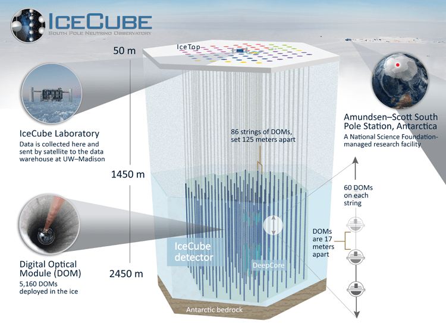<br>[icecube.png](figures/report/icecube.png) | Places the analysis in the IceCube detector geometry: strings, DOMs, DeepCore, and IceTop. | External/reference detector schematic used in the report. |
| 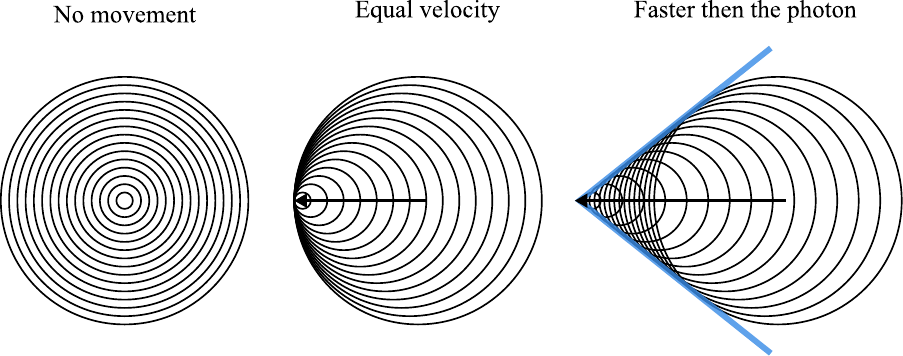<br>[shrenkov.pdf](figures/report/shrenkov.pdf) | Explains why charged particles crossing the ice produce the light recorded by DOMs. | Report schematic asset. |
| 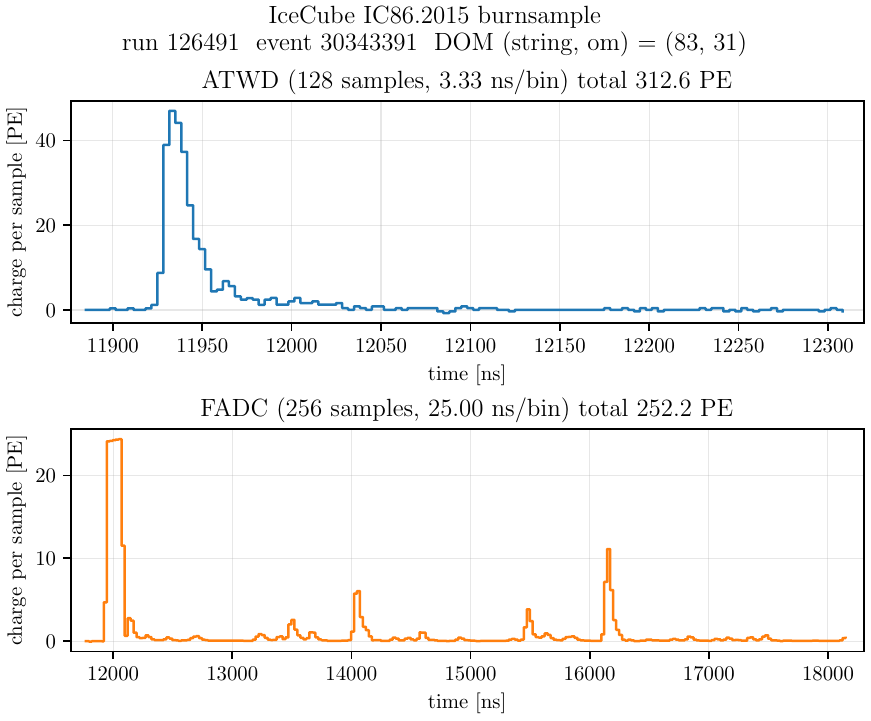<br>[plot_run126491_event30343391_DOM83-31-0.pdf](figures/report/plot_run126491_event30343391_DOM83-31-0.pdf) | Shows the detailed ATWD/fADC waveform behind one real HLC hit, including later small pulses. | [waveform_demo](analysis/MC_vs_BS_analysis/GBreweighting/validation/waveform_demo/) |
| 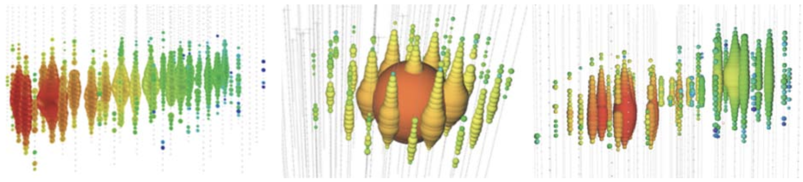<br>[icecube_events.png](figures/report/icecube_events.png) | Shows the pulse-level appearance of track, cascade, and double-bang event types. | External/reference event-type figure used in the report. |
| 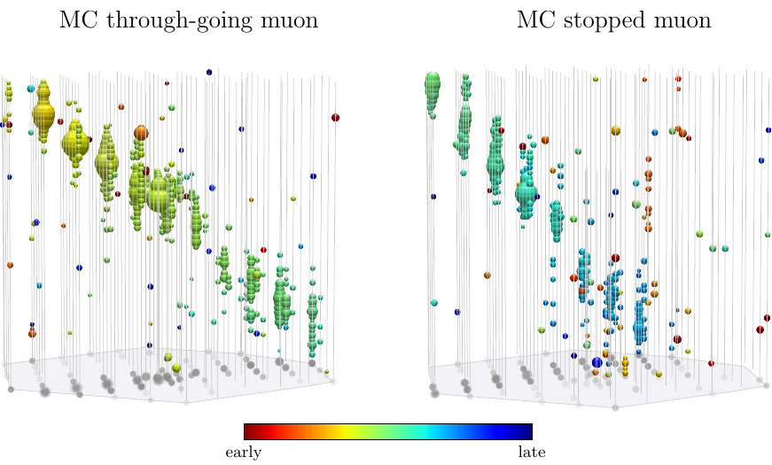<br>[event_display_through_stopped.pdf](figures/report/event_display_through_stopped.pdf) | Motivates why stopped and through-going atmospheric muons are treated as separate classes. | [plot_event_display_through_stopped.py](analysis/MC_vs_BS_analysis/GBreweighting/validation/plot_event_display_through_stopped.py), [pulse_event_display.py](analysis/MC_vs_BS_analysis/GBreweighting/validation/pulse_event_display.py) |

</details>

### 3. Machine-learning tools used later

The report introduces two families of tools. Gradient-boosted decision trees
are used for reweighting MC in reconstructed direction space. Transformer
models are used for the main pulse-level tasks: stopped/through classification,
direction reconstruction, MC-vs-data benchmarking, and HLC re-labelling.

These figures are not results by themselves. They are included because they
explain the machinery used later.

<details>
<summary><strong>Open machine-learning schematic figures</strong></summary>

| Figure | Why it is here | Code/source |
|---|---|---|
| 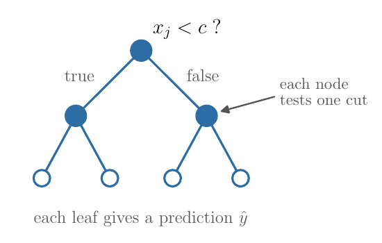<br>[decision_tree.pdf](figures/report/decision_tree.pdf) | Introduces the threshold-cut logic behind tree models. | [make_ch3_figures.py](figures/report/make_ch3_figures.py) |
| 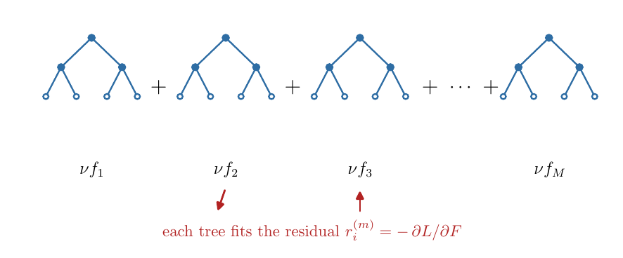<br>[bdt_schematic.pdf](figures/report/bdt_schematic.pdf) | Explains why many shallow trees can form a stronger boosted model. | [make_ch3_figures.py](figures/report/make_ch3_figures.py) |
| 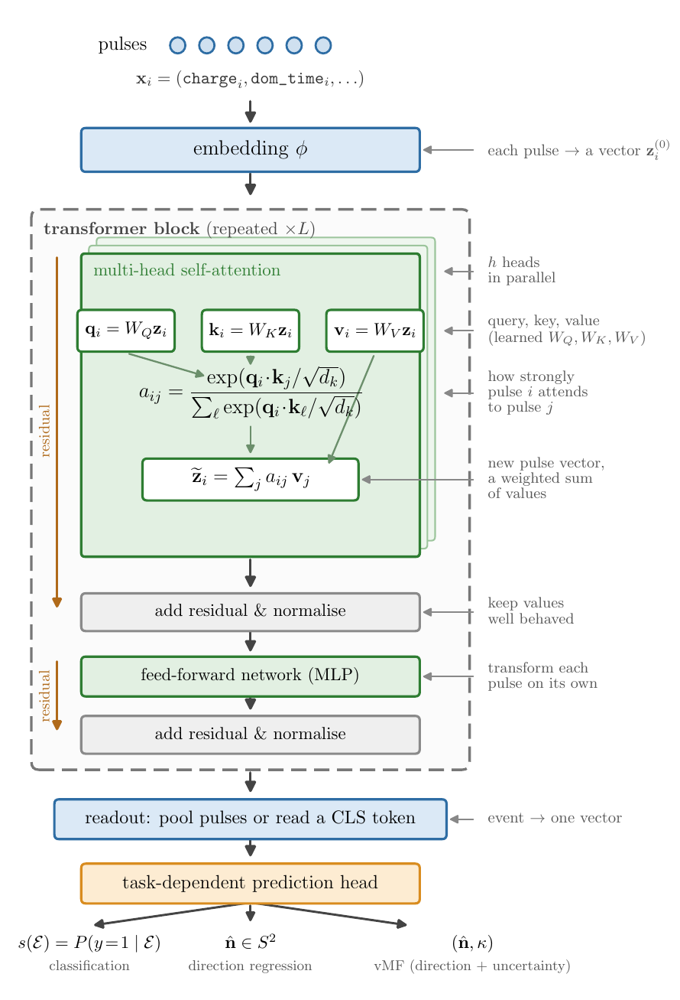<br>[transformer_architecture.pdf](figures/report/transformer_architecture.pdf) | Shows the event model used repeatedly: pulse tokens, embeddings, transformer blocks, pooling, and prediction head. | [make_ch3_figures.py](figures/report/make_ch3_figures.py) |

</details>

### 4. Stopped/through-going classifier

Stopped and through-going muons have different light patterns, so the project
does not compare them as one mixed sample. A transformer is trained on MC truth
labels to split the simulated events, and then the same model is applied to
both MC and real burnsample data.

This is the first important analysis dependency: every later MC-vs-data
comparison is performed separately for the two classifier-defined classes.

Code:

- [train_stopped_transformer.py](analysis/ThroughOrStopped_muon/train_stopped_transformer.py)
- [run_inference.py](analysis/ThroughOrStopped_muon/inference/run_inference.py)
- [plot_stopped_transformer_documentation.py](analysis/MC_vs_BS_analysis/GBreweighting/validation/stopped_transformer_documentation/plot_stopped_transformer_documentation.py)

<details>
<summary><strong>Open stopped/through classifier figures</strong></summary>

| Figure | Why it is here | Code/source |
|---|---|---|
| 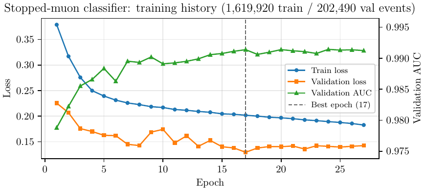<br>[training_history.pdf](figures/report/training_history.pdf) | Verifies the training behavior and selected best epoch for the stopped/through model. | [train_stopped_transformer.py](analysis/ThroughOrStopped_muon/train_stopped_transformer.py), [plot_stopped_transformer_documentation.py](analysis/MC_vs_BS_analysis/GBreweighting/validation/stopped_transformer_documentation/plot_stopped_transformer_documentation.py) |
| 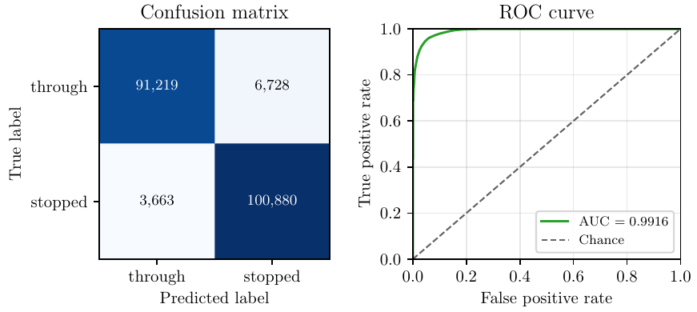<br>[test_performance.pdf](figures/report/test_performance.pdf) | Shows the held-out MC classification performance that justifies using the split downstream. | [plot_stopped_transformer_documentation.py](analysis/MC_vs_BS_analysis/GBreweighting/validation/stopped_transformer_documentation/plot_stopped_transformer_documentation.py) |
| 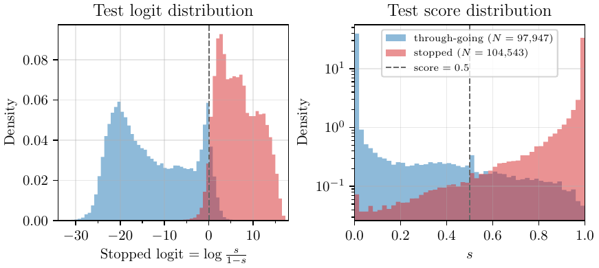<br>[mc_test_score_distributions.pdf](figures/report/mc_test_score_distributions.pdf) | Shows how the model output separates the two MC truth classes. | [plot_stopped_transformer_documentation.py](analysis/MC_vs_BS_analysis/GBreweighting/validation/stopped_transformer_documentation/plot_stopped_transformer_documentation.py) |

</details>

### 5. Baseline MC-vs-data comparison

The baseline comparison asks what differs before any correction. Pulse-level
and event-level histograms show visible discrepancies: low-charge behavior,
time tails, depth structure, high-charge tails, and HLC fraction. The stronger
test is the MC-vs-data transformer, which confirms that the joint feature-space
mismatch is large.

Code:

- [transformer model code](analysis/MC_vs_BS_analysis/GBreweighting/validation/transformer/)
- [train_mcdata_parquet.py](analysis/MC_vs_BS_analysis/GBreweighting/validation/Data_vs_MC_new/train_mcdata_parquet.py)
- [make_pulse_level_a4_figure.py](analysis/MC_vs_BS_analysis/GBreweighting/validation/make_pulse_level_a4_figure.py)
- [make_event_aggregate_a4_figure.py](analysis/MC_vs_BS_analysis/GBreweighting/validation/make_event_aggregate_a4_figure.py)

<details>
<summary><strong>Open baseline distribution figures</strong></summary>

| Figure | Why it is here | Code/source |
|---|---|---|
| 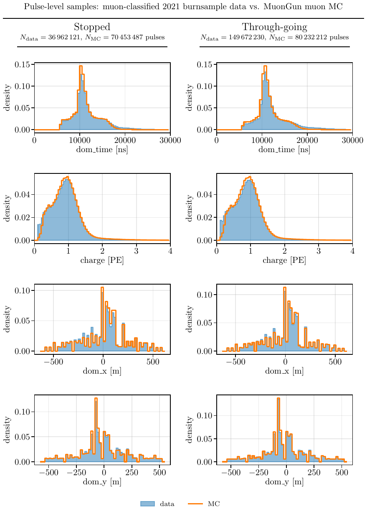<br>[pulse_level_variables_unmerged_full_page1.pdf](figures/report/pulse_level_variables_unmerged_full_page1.pdf) | Shows baseline `dom_time`, `charge`, `dom_x`, and `dom_y` disagreements by event class. | [make_pulse_level_a4_figure.py](analysis/MC_vs_BS_analysis/GBreweighting/validation/make_pulse_level_a4_figure.py) |
| 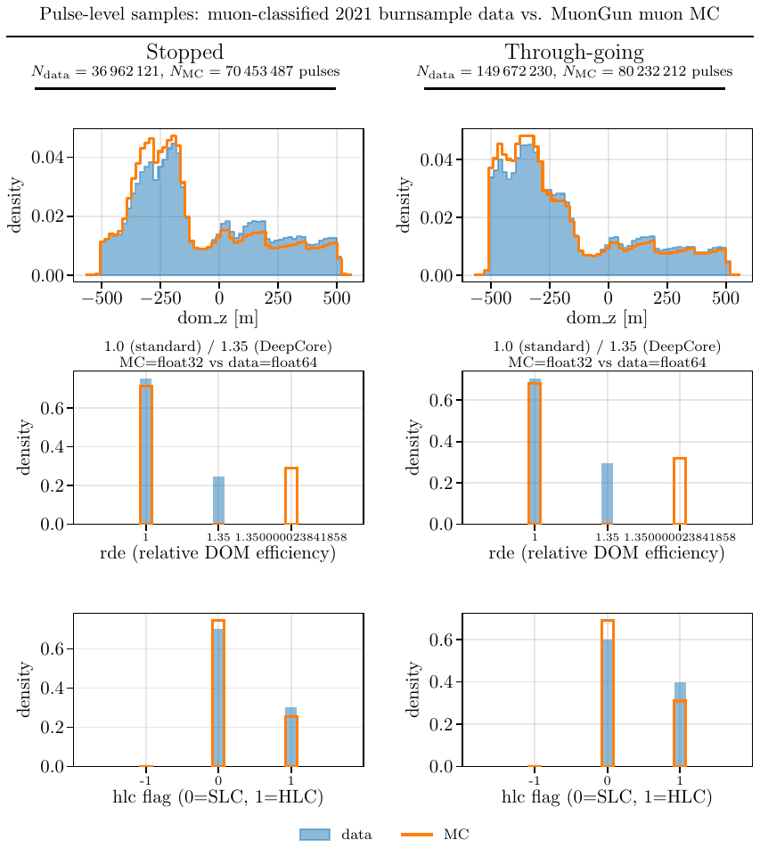<br>[pulse_level_variables_unmerged_full_page2.pdf](figures/report/pulse_level_variables_unmerged_full_page2.pdf) | Shows baseline `dom_z`, `rde`, and `hlc` behavior, including the important HLC mismatch. | [make_pulse_level_a4_figure.py](analysis/MC_vs_BS_analysis/GBreweighting/validation/make_pulse_level_a4_figure.py) |
| 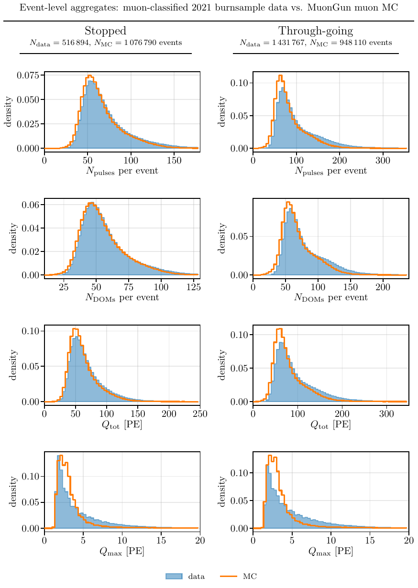<br>[event_level_aggregates_unmerged_full_page1.pdf](figures/report/event_level_aggregates_unmerged_full_page1.pdf) | Compares event size and charge summaries before corrections. | [make_event_aggregate_a4_figure.py](analysis/MC_vs_BS_analysis/GBreweighting/validation/make_event_aggregate_a4_figure.py) |
| 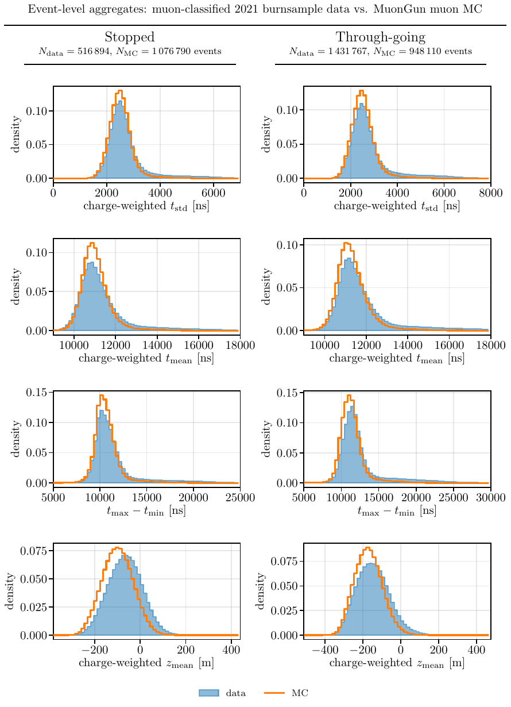<br>[event_level_aggregates_unmerged_full_page2.pdf](figures/report/event_level_aggregates_unmerged_full_page2.pdf) | Compares event time and depth summaries before corrections. | [make_event_aggregate_a4_figure.py](analysis/MC_vs_BS_analysis/GBreweighting/validation/make_event_aggregate_a4_figure.py) |
| 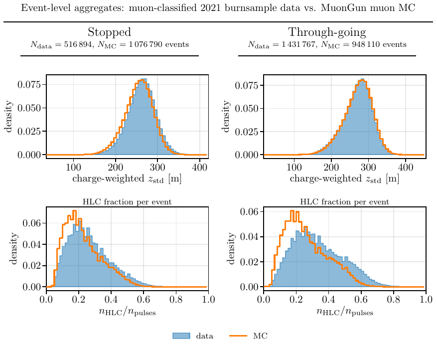<br>[event_level_aggregates_unmerged_full_page3.pdf](figures/report/event_level_aggregates_unmerged_full_page3.pdf) | Shows depth spread and HLC fraction at event level, which motivates later HLC work. | [make_event_aggregate_a4_figure.py](analysis/MC_vs_BS_analysis/GBreweighting/validation/make_event_aggregate_a4_figure.py) |

</details>

### 6. Direction reconstruction and angular GB reweighting

The first correction tests whether MC and data disagree partly because they
enter the detector from different directions. A transformer reconstructs zenith
and azimuth. A gradient-boosted reweighter then changes the MC weights in
reconstructed `(zenith, azimuth)` space so that the angular distribution
matches data more closely.

This correction improves the benchmark and fixes the targeted angular
distributions, but much of the MC-vs-data separability remains.

Code:

- [direction_transformer_hlc_rde_unmerged_2M](analysis/MC_vs_BS_analysis/GBreweighting/validation/direction_transformer_hlc_rde_unmerged_2M/)
- [plot_direction_transformer_documentation.py](analysis/MC_vs_BS_analysis/GBreweighting/validation/direction_transformer_hlc_rde_unmerged_2M/documentation_plots/plot_direction_transformer_documentation.py)
- [fit_GBreweighter_hlc_rde_unmerged_2M.py](analysis/MC_vs_BS_analysis/GBreweighting/fit_GBreweighter_hlc_rde_unmerged_2M.py)

<details>
<summary><strong>Open direction and GB-reweighting figures</strong></summary>

| Figure | Why it is here | Code/source |
|---|---|---|
| 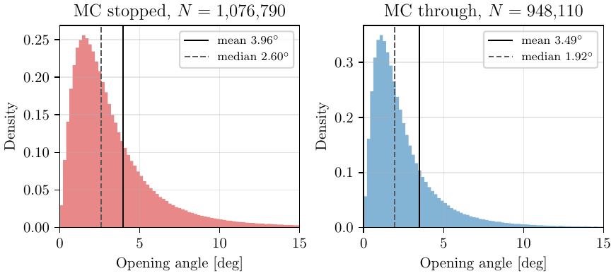<br>[open_angle_performance.pdf](figures/report/open_angle_performance.pdf) | Shows the direction reconstruction quality on held-out MC. | [plot_direction_transformer_documentation.py](analysis/MC_vs_BS_analysis/GBreweighting/validation/direction_transformer_hlc_rde_unmerged_2M/documentation_plots/plot_direction_transformer_documentation.py) |
| 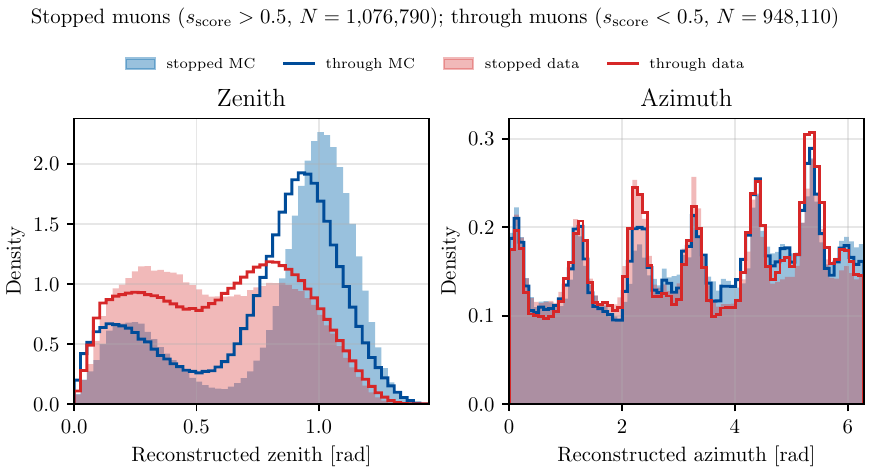<br>[mc_data_zenith_azimuth_overlay.pdf](figures/report/mc_data_zenith_azimuth_overlay.pdf) | Shows the reconstructed direction mismatch before angular reweighting. | [plot_direction_transformer_documentation.py](analysis/MC_vs_BS_analysis/GBreweighting/validation/direction_transformer_hlc_rde_unmerged_2M/documentation_plots/plot_direction_transformer_documentation.py) |
| 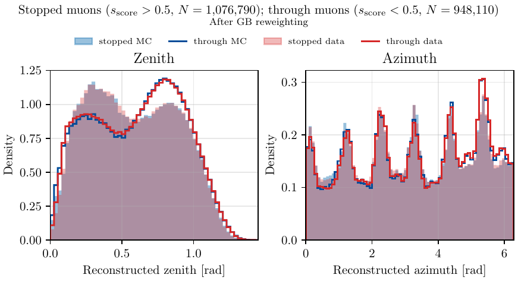<br>[mc_data_zenith_azimuth_overlay_with_GBR.pdf](figures/report/mc_data_zenith_azimuth_overlay_with_GBR.pdf) | Confirms that the GB reweighter fixes the direction distribution it was trained to fix. | [fit_GBreweighter_hlc_rde_unmerged_2M.py](analysis/MC_vs_BS_analysis/GBreweighting/fit_GBreweighter_hlc_rde_unmerged_2M.py), [plot_direction_transformer_documentation.py](analysis/MC_vs_BS_analysis/GBreweighting/validation/direction_transformer_hlc_rde_unmerged_2M/documentation_plots/plot_direction_transformer_documentation.py) |
| 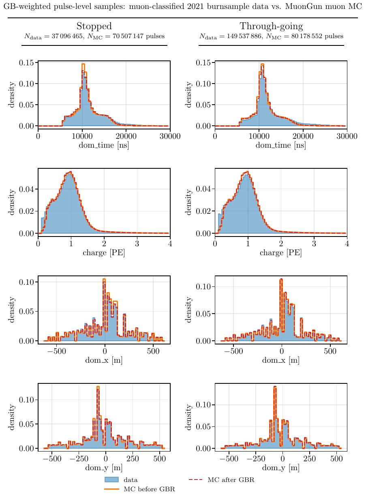<br>[pulse_level_variables_unmerged_gbweighted_full_page1.pdf](figures/report/pulse_level_variables_unmerged_gbweighted_full_page1.pdf) | Tests whether angular weights also improve pulse-level variables such as charge and horizontal position. | [make_pulse_level_a4_figure.py](analysis/MC_vs_BS_analysis/GBreweighting/validation/make_pulse_level_a4_figure.py) |
| 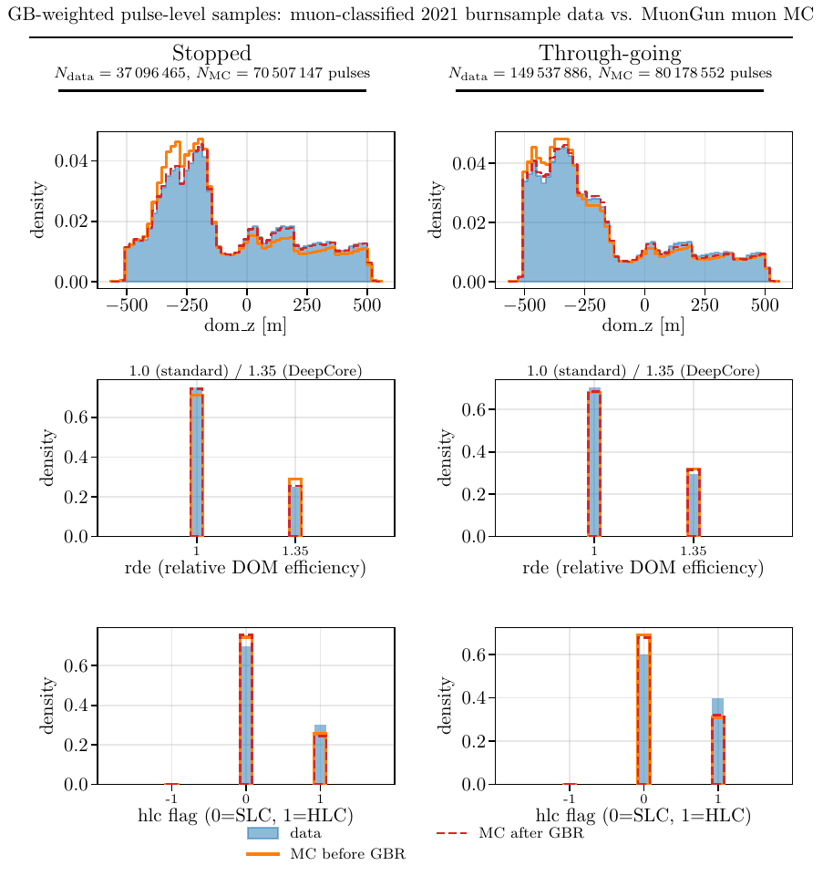<br>[pulse_level_variables_unmerged_gbweighted_full_page2.pdf](figures/report/pulse_level_variables_unmerged_gbweighted_full_page2.pdf) | Tests whether angular weights improve vertical position, DOM efficiency, and HLC behavior. | [make_pulse_level_a4_figure.py](analysis/MC_vs_BS_analysis/GBreweighting/validation/make_pulse_level_a4_figure.py) |
| 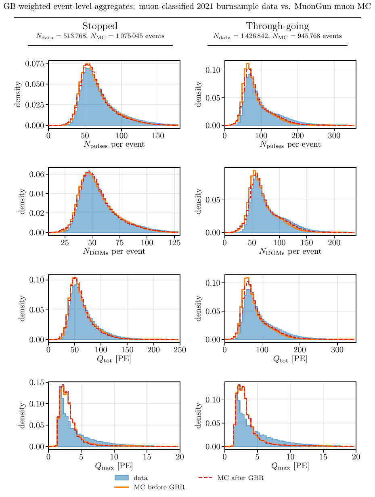<br>[event_level_aggregates_unmerged_gbweighted_full_page1.pdf](figures/report/event_level_aggregates_unmerged_gbweighted_full_page1.pdf) | Checks event size and charge summaries after angular weighting. | [make_event_aggregate_a4_figure.py](analysis/MC_vs_BS_analysis/GBreweighting/validation/make_event_aggregate_a4_figure.py) |
| 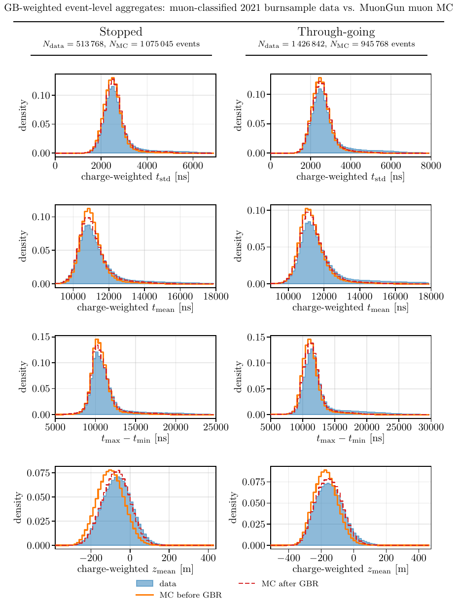<br>[event_level_aggregates_unmerged_gbweighted_full_page2.pdf](figures/report/event_level_aggregates_unmerged_gbweighted_full_page2.pdf) | Checks time and depth summaries after angular weighting. | [make_event_aggregate_a4_figure.py](analysis/MC_vs_BS_analysis/GBreweighting/validation/make_event_aggregate_a4_figure.py) |
| 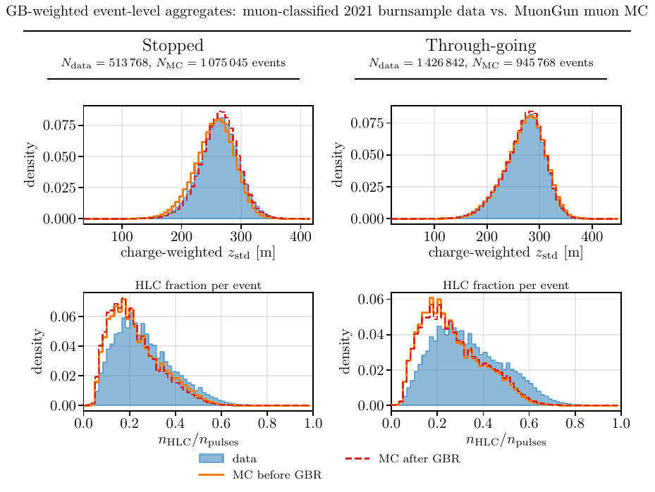<br>[event_level_aggregates_unmerged_gbweighted_full_page3.pdf](figures/report/event_level_aggregates_unmerged_gbweighted_full_page3.pdf) | Shows that HLC fraction remains a strong residual mismatch after angular weighting. | [make_event_aggregate_a4_figure.py](analysis/MC_vs_BS_analysis/GBreweighting/validation/make_event_aggregate_a4_figure.py) |

</details>

### 7. Pulse merging

The angular correction does not remove the low-charge excess in data. The next
step targets a pulse-splitting effect: small HLC pulses below `0.3 PE` are
merged into the nearest above-threshold pulse on the same DOM using the
`PulseMerger` algorithm.

This step is physically motivated by waveform behavior and improves the
benchmark, but only modestly.

Code:

- [pulse_merger.py](analysis/MC_vs_BS_analysis/GBreweighting/pulse_merger.py)
- [plot_pulse_merging.py](analysis/MC_vs_BS_analysis/GBreweighting/validation/data_parquet_v2/pulse_merging_plots/plot_pulse_merging.py)
- [make_small_pulse_merge_plot.py](analysis/MC_vs_BS_analysis/GBreweighting/validation/Data_vs_MC_new/plots/small_pulses/make_small_pulse_merge_plot.py)

<details>
<summary><strong>Open pulse-merging figures</strong></summary>

| Figure | Why it is here | Code/source |
|---|---|---|
| 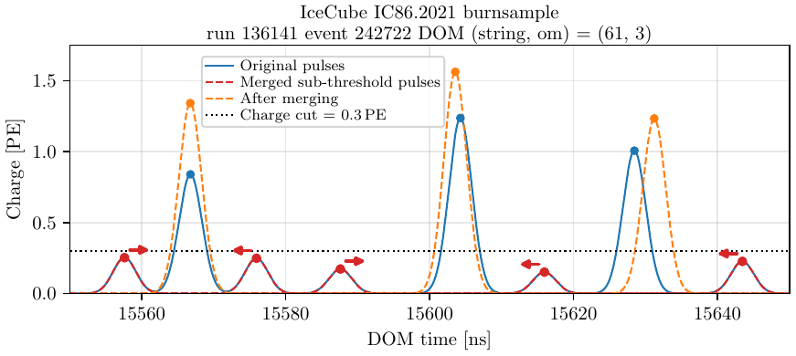<br>[small_pulses_through_run136141_event242722_string61_dom3_final_legend_default_up.pdf](figures/report/small_pulses_through_run136141_event242722_string61_dom3_final_legend_default_up.pdf) | Demonstrates the pulse-merging rule on one DOM signal rather than only as an abstract algorithm. | [make_small_pulse_merge_plot.py](analysis/MC_vs_BS_analysis/GBreweighting/validation/Data_vs_MC_new/plots/small_pulses/make_small_pulse_merge_plot.py), [pulse_merger.py](analysis/MC_vs_BS_analysis/GBreweighting/pulse_merger.py) |
| 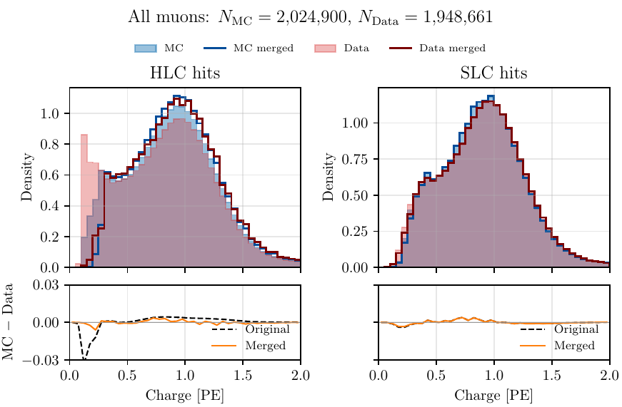<br>[mc_data_charge_hlc_slc.pdf](figures/report/mc_data_charge_hlc_slc.pdf) | Shows how charge distributions differ for HLC and SLC pulses and why low-charge handling matters. | [plot_pulse_merging.py](analysis/MC_vs_BS_analysis/GBreweighting/validation/data_parquet_v2/pulse_merging_plots/plot_pulse_merging.py) |
| 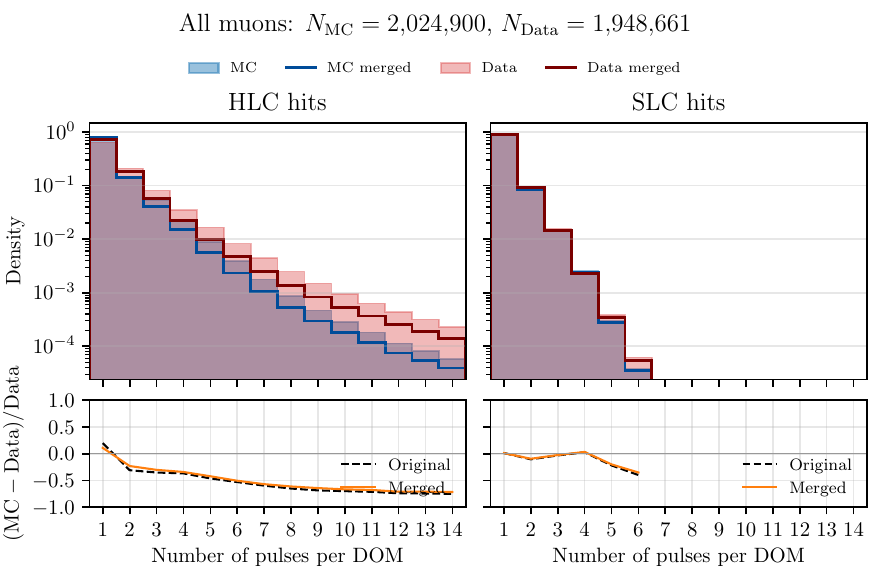<br>[pulses_per_dom.pdf](figures/report/pulses_per_dom.pdf) | Checks whether MC and data differ in multi-pulse DOM behavior. | [plot_pulse_merging.py](analysis/MC_vs_BS_analysis/GBreweighting/validation/data_parquet_v2/pulse_merging_plots/plot_pulse_merging.py) |

</details>

### 8. Feature importance and HLC re-labelling

After pulse merging, permutation feature importance points to the `hlc` flag as
the strongest remaining pulse-level carrier of MC-vs-data separation. The
project therefore trains an HLC/SLC classifier on real data and applies it to
MC. The most HLC-like simulated SLC pulses are flipped to HLC until the
event-level HLC-fraction distribution best matches data.

This is the most important correction in the project.

Code:

- [eval_transformer_perm_compare_hlcflip.py](analysis/MC_vs_BS_analysis/GBreweighting/validation/eval_transformer_perm_compare_hlcflip.py)
- [run_hlc_flip_sweep_merged_v2_all.py](analysis/MC_vs_BS_analysis/GBreweighting/validation/run_hlc_flip_sweep_merged_v2_all.py)
- [apply_transformer_hlc_best_flip_parquets.py](analysis/MC_vs_BS_analysis/GBreweighting/validation/apply_transformer_hlc_best_flip_parquets.py)
- [plot_hlc_flip_sweep_merged_v2_side_by_side.py](analysis/MC_vs_BS_analysis/GBreweighting/validation/plot_hlc_flip_sweep_merged_v2_side_by_side.py)

<details>
<summary><strong>Open HLC feature and re-labelling figures</strong></summary>

| Figure | Why it is here | Code/source |
|---|---|---|
| 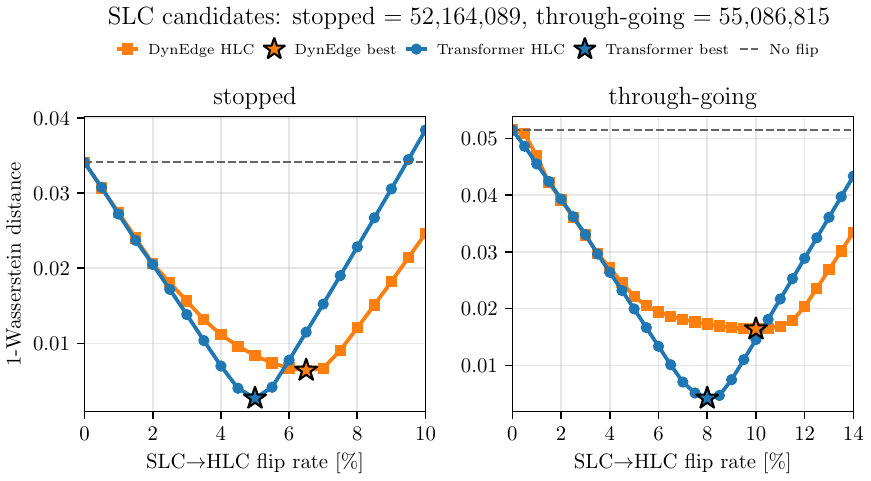<br>[hlc_flip_rate_sweep_merged_v2_stopped_through_side_by_side_0_to_10p0_step0p5.pdf](figures/report/hlc_flip_rate_sweep_merged_v2_stopped_through_side_by_side_0_to_10p0_step0p5.pdf) | Chooses the SLC-to-HLC flip rate by minimizing the MC/data HLC-fraction Wasserstein distance. | [run_hlc_flip_sweep_merged_v2_all.py](analysis/MC_vs_BS_analysis/GBreweighting/validation/run_hlc_flip_sweep_merged_v2_all.py), [plot_hlc_flip_sweep_merged_v2_side_by_side.py](analysis/MC_vs_BS_analysis/GBreweighting/validation/plot_hlc_flip_sweep_merged_v2_side_by_side.py) |
| 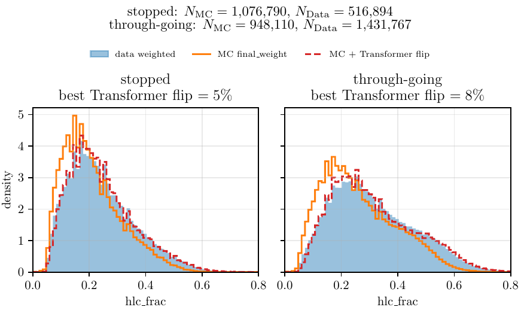<br>[hlc_frac_mc_vs_data_merged_v2_stopped_through_best_transformer_flip_side_by_side.pdf](figures/report/hlc_frac_mc_vs_data_merged_v2_stopped_through_best_transformer_flip_side_by_side.pdf) | Shows the HLC-fraction distribution after the selected transformer-based flip. | [plot_hlc_frac_merged_v2_best_transformer_flip.py](analysis/MC_vs_BS_analysis/GBreweighting/validation/plot_hlc_frac_merged_v2_best_transformer_flip.py) |

</details>

### 9. Charge-time and afterpulse search

The waveform example earlier shows delayed small pulses after a main signal.
The report therefore checks whether an afterpulse-like structure appears in
the `charge` vs `dom_time` plane after the main corrections. The search does
not find a clean isolated delayed low-charge island in the pulse-level
representation.

Code:

- [plot_afterpulse_a4_transformer_hlcflip_best.py](analysis/MC_vs_BS_analysis/GBreweighting/validation/plot_afterpulse_a4_transformer_hlcflip_best.py)
- [plot_afterpulse_master.py](analysis/MC_vs_BS_analysis/GBreweighting/validation/plot_afterpulse_master.py)
- [waveform_demo](analysis/MC_vs_BS_analysis/GBreweighting/validation/waveform_demo/)

<details>
<summary><strong>Open charge-time and afterpulse figures</strong></summary>

| Figure | Why it is here | Code/source |
|---|---|---|
| 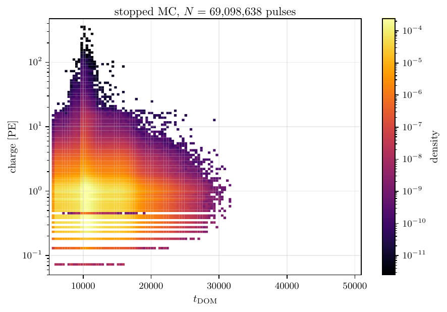<br>[afterpulse_stopped_mc_transformer_hlcflip_best.pdf](figures/report/afterpulse_stopped_mc_transformer_hlcflip_best.pdf) | Charge-time plane for stopped MC after the main corrections. | [plot_afterpulse_a4_transformer_hlcflip_best.py](analysis/MC_vs_BS_analysis/GBreweighting/validation/plot_afterpulse_a4_transformer_hlcflip_best.py) |
| 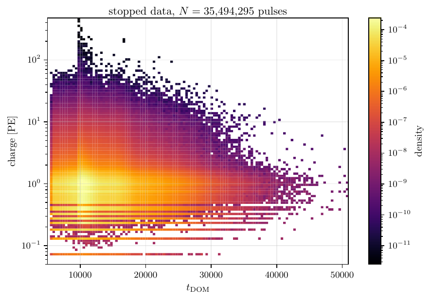<br>[afterpulse_stopped_data_transformer_hlcflip_best.pdf](figures/report/afterpulse_stopped_data_transformer_hlcflip_best.pdf) | Charge-time plane for stopped data after the main corrections. | [plot_afterpulse_a4_transformer_hlcflip_best.py](analysis/MC_vs_BS_analysis/GBreweighting/validation/plot_afterpulse_a4_transformer_hlcflip_best.py) |
| 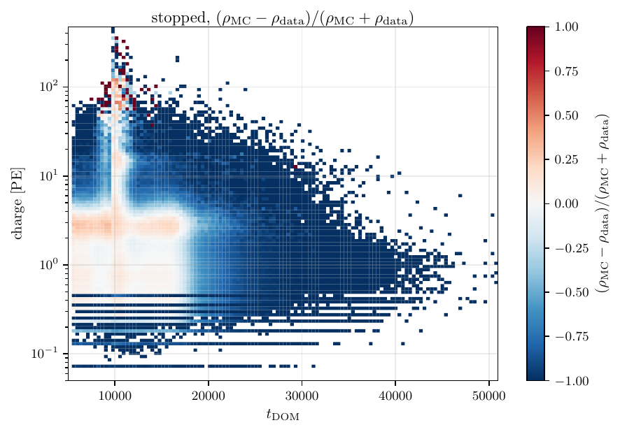<br>[afterpulse_stopped_mc_over_data_transformer_hlcflip_best.pdf](figures/report/afterpulse_stopped_mc_over_data_transformer_hlcflip_best.pdf) | Residual view for stopped events, used to look for localized MC/data structures. | [plot_afterpulse_a4_transformer_hlcflip_best.py](analysis/MC_vs_BS_analysis/GBreweighting/validation/plot_afterpulse_a4_transformer_hlcflip_best.py) |
| 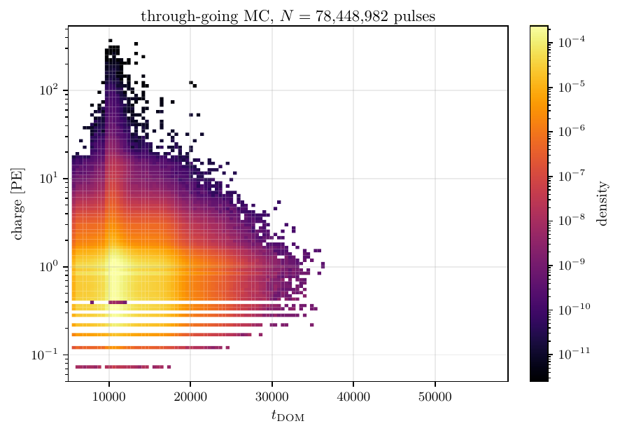<br>[afterpulse_through_mc_transformer_hlcflip_best.pdf](figures/report/afterpulse_through_mc_transformer_hlcflip_best.pdf) | Charge-time plane for through-going MC after the main corrections. | [plot_afterpulse_a4_transformer_hlcflip_best.py](analysis/MC_vs_BS_analysis/GBreweighting/validation/plot_afterpulse_a4_transformer_hlcflip_best.py) |
| 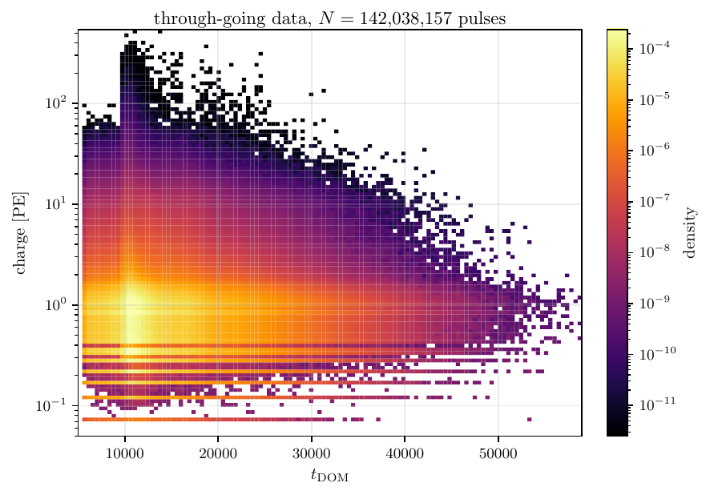<br>[afterpulse_through_data_transformer_hlcflip_best.pdf](figures/report/afterpulse_through_data_transformer_hlcflip_best.pdf) | Charge-time plane for through-going data after the main corrections. | [plot_afterpulse_a4_transformer_hlcflip_best.py](analysis/MC_vs_BS_analysis/GBreweighting/validation/plot_afterpulse_a4_transformer_hlcflip_best.py) |
| 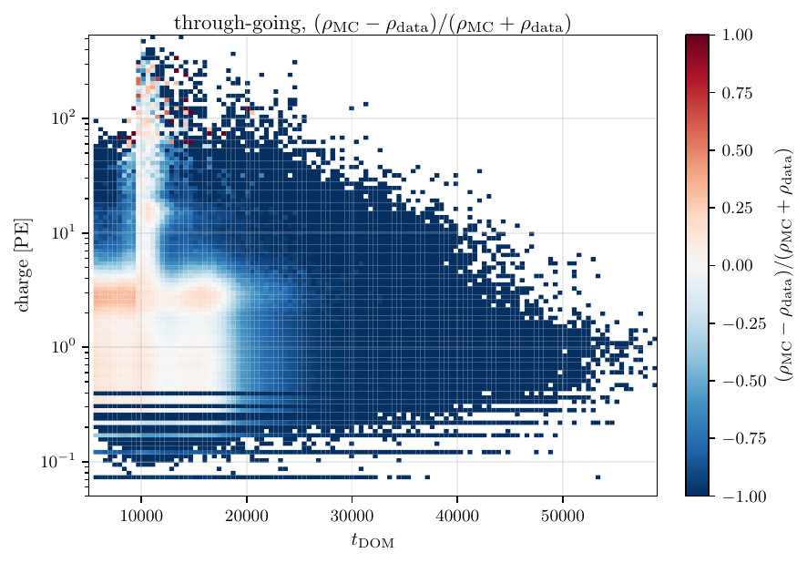<br>[afterpulse_through_mc_over_data_transformer_hlcflip_best.pdf](figures/report/afterpulse_through_mc_over_data_transformer_hlcflip_best.pdf) | Residual view for through-going events, used to look for localized delayed-pulse structure. | [plot_afterpulse_a4_transformer_hlcflip_best.py](analysis/MC_vs_BS_analysis/GBreweighting/validation/plot_afterpulse_a4_transformer_hlcflip_best.py) |

</details>

### 10. vMF uncertainty and final diagnostic

The final direction model predicts both a direction and a von Mises-Fisher
concentration parameter `kappa`. Large `kappa` means the model is confident;
small `kappa` means the event is diffuse or ambiguous. Low-`kappa` MC events
show a pole-collapse behavior in the direction prediction, so events with
`kappa < 10` are removed as the final diagnostic cut.

This improves the final benchmark slightly and identifies a concrete
problematic MC population.

Code:

- [direction_transformer_vmf_final_hlcflip](analysis/MC_vs_BS_analysis/GBreweighting/validation/direction_transformer_vmf_final_hlcflip/)
- [vmf_code_bundle](analysis/MC_vs_BS_analysis/GBreweighting/validation/vmf_code_bundle/)
- [plot_vmf_uncertainty_final_hlcflip.py](analysis/MC_vs_BS_analysis/GBreweighting/validation/plot_vmf_uncertainty_final_hlcflip.py)
- [plot_vmf_pole_collapse_evidence.py](analysis/MC_vs_BS_analysis/GBreweighting/validation/plot_vmf_pole_collapse_evidence.py)

<details>
<summary><strong>Open vMF uncertainty figures</strong></summary>

| Figure | Why it is here | Code/source |
|---|---|---|
| 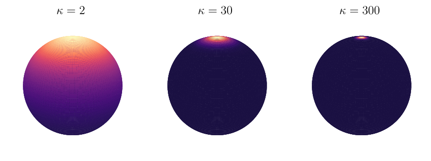<br>[vmf_sphere.pdf](figures/report/vmf_sphere.pdf) | Explains the meaning of the vMF concentration parameter `kappa`. | Report schematic asset used by the vMF section. |
| 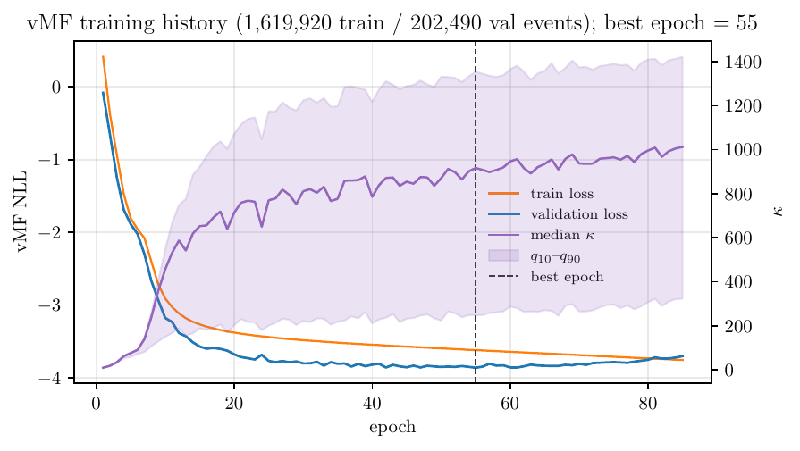<br>[vmf_training_history_loss_opening_kappa.pdf](figures/report/vmf_training_history_loss_opening_kappa.pdf) | Shows vMF direction-model training, opening angle, and predicted uncertainty behavior. | [train_vmf_final_hlcflip.py](analysis/MC_vs_BS_analysis/GBreweighting/validation/direction_transformer_vmf_final_hlcflip/train_vmf_final_hlcflip.py), [plot_vmf_uncertainty_final_hlcflip.py](analysis/MC_vs_BS_analysis/GBreweighting/validation/plot_vmf_uncertainty_final_hlcflip.py) |
| 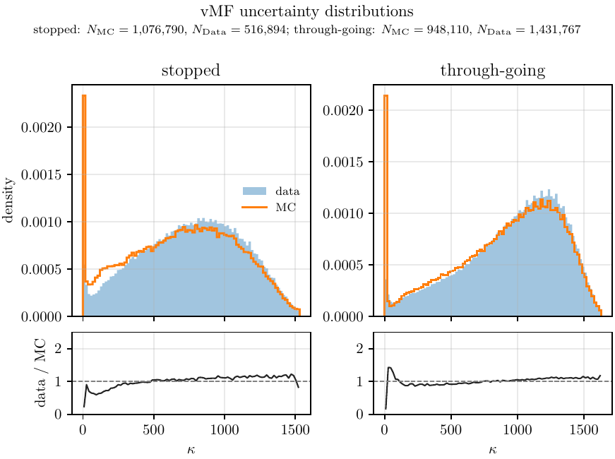<br>[vmf_kappa_mc_data_stopped_through_side_by_side.pdf](figures/report/vmf_kappa_mc_data_stopped_through_side_by_side.pdf) | Compares predicted event confidence in MC and data for stopped and through-going samples. | [plot_vmf_uncertainty_final_hlcflip.py](analysis/MC_vs_BS_analysis/GBreweighting/validation/plot_vmf_uncertainty_final_hlcflip.py) |
| 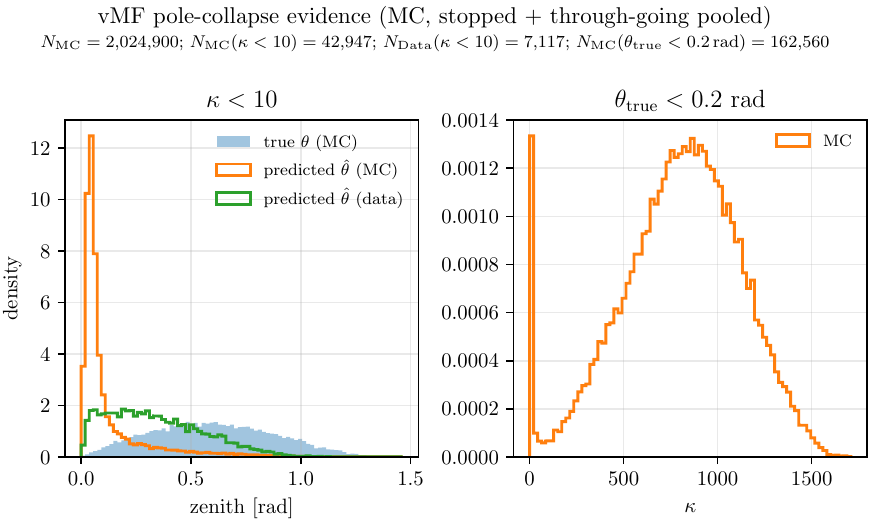<br>[vmf_pole_collapse_evidence.pdf](figures/report/vmf_pole_collapse_evidence.pdf) | Diagnoses the low-`kappa` MC population where predictions collapse toward the vertical. | [plot_vmf_pole_collapse_evidence.py](analysis/MC_vs_BS_analysis/GBreweighting/validation/plot_vmf_pole_collapse_evidence.py), [diagnose_low_kappa_mc.py](analysis/MC_vs_BS_analysis/GBreweighting/validation/diagnose_low_kappa_mc.py) |

</details>

### 11. Final benchmark and interpretation

The final section collects the staged MC-vs-data benchmark. The ROC curves show
that the classifier can still separate the samples after all corrections. The
logit distributions show a softer but important point: the corrections remove
much of the classifier confidence, especially for stopped muons.

The remaining mismatch is likely not one single effect. The report points to
several plausible directions: residual time-distribution issues, horizontal
coordinate or surface-entry differences, multi-pulse DOM behavior, HLC/SLC
modeling, afterpulse effects that are difficult to isolate after pulse
extraction, and possible imperfections in the muon selection or stopped/through
split.

Code:

- [build_stage_test_logits.py](analysis/MC_vs_BS_analysis/GBreweighting/validation/Data_vs_MC_new/build_stage_test_logits.py)
- [plot_stage_logit_roc_overlay.py](analysis/MC_vs_BS_analysis/GBreweighting/validation/Data_vs_MC_new/plot_stage_logit_roc_overlay.py)
- [plot_stage_logit_catalog.py](analysis/MC_vs_BS_analysis/GBreweighting/validation/Data_vs_MC_new/plot_stage_logit_catalog.py)

<details open>
<summary><strong>Open final benchmark figures</strong></summary>

| Figure | Why it is here | Code/source |
|---|---|---|
| <br>[five_stage_logit_roc_overlay_combined.pdf](figures/report/five_stage_logit_roc_overlay_combined.pdf) | The central project result: staged MC-vs-data separability after each correction. | [plot_stage_logit_roc_overlay.py](analysis/MC_vs_BS_analysis/GBreweighting/validation/Data_vs_MC_new/plot_stage_logit_roc_overlay.py) |
| <br>[logit_catalog_common_xlim.pdf](figures/report/logit_catalog_common_xlim.pdf) | Shows how the classifier confidence changes across the correction chain. | [plot_stage_logit_catalog.py](analysis/MC_vs_BS_analysis/GBreweighting/validation/Data_vs_MC_new/plot_stage_logit_catalog.py) |

</details>

## Figure Coverage

All 41 visual figures used by `main.pdf` are represented in this README. PDFs
are displayed through PNG previews in `figures/report_previews/`, while the
original PDF files remain linked. For a compact table of the same figure-to-code
mapping, use [docs/figure_index.md](docs/figure_index.md).

## What Is Not Here

The repository intentionally excludes raw data and heavy generated products:

- IceCube `.i3`, SQLite `.db`, parquet, CSV, NumPy, pickle, HDF5, and ROOT
  data.
- Model checkpoints and exported weights.
- Slurm logs, cache directories, and local notebook checkpoints.
- The local LaTeX report source and compiled report products from
  `/groups/icecube/holgerkc/final`.

The included figures are exceptions because they are needed to read and inspect
the project on GitHub without regenerating the full analysis.

## AI Assistance Note

This GitHub-facing project archive and documentation structure was assembled
with help from OpenAI Codex. The scientific work, analysis ideas, and local
project files come from Holger Klevang Christiansen's IceCube preparation
project; Codex was used to organize the repository, connect figures to code,
and write the navigational documentation.
